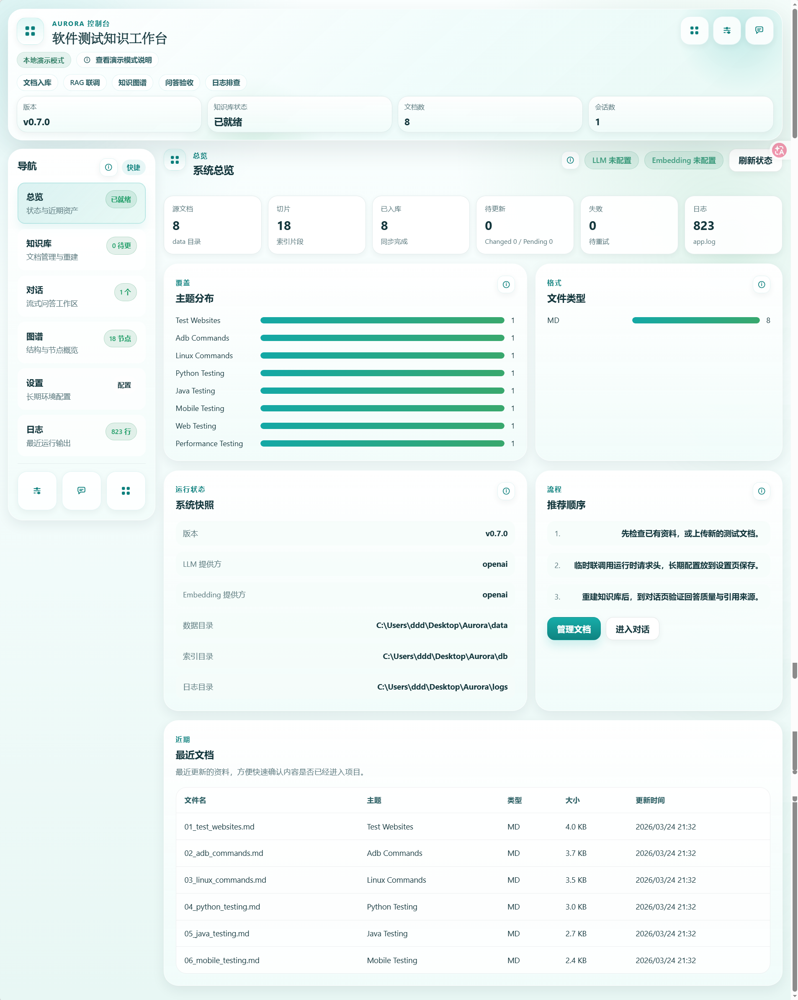
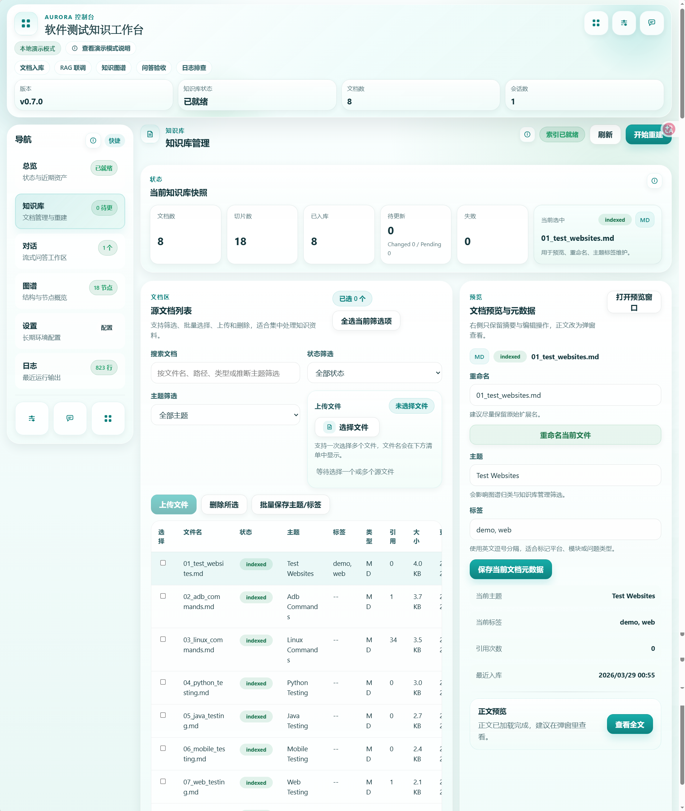
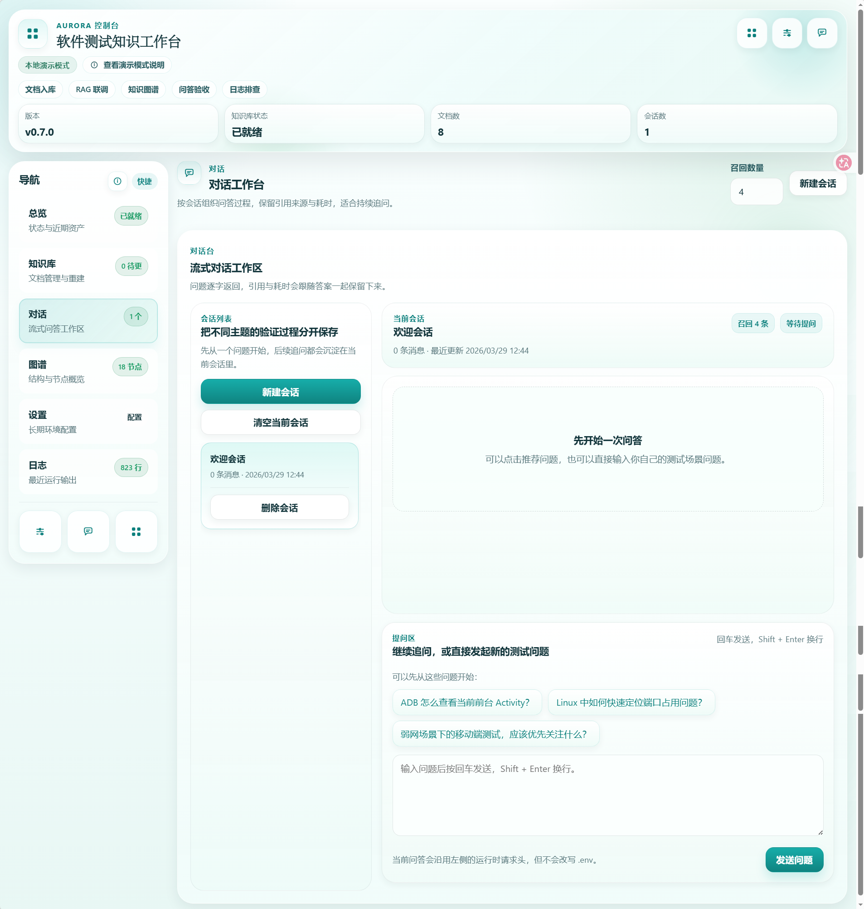
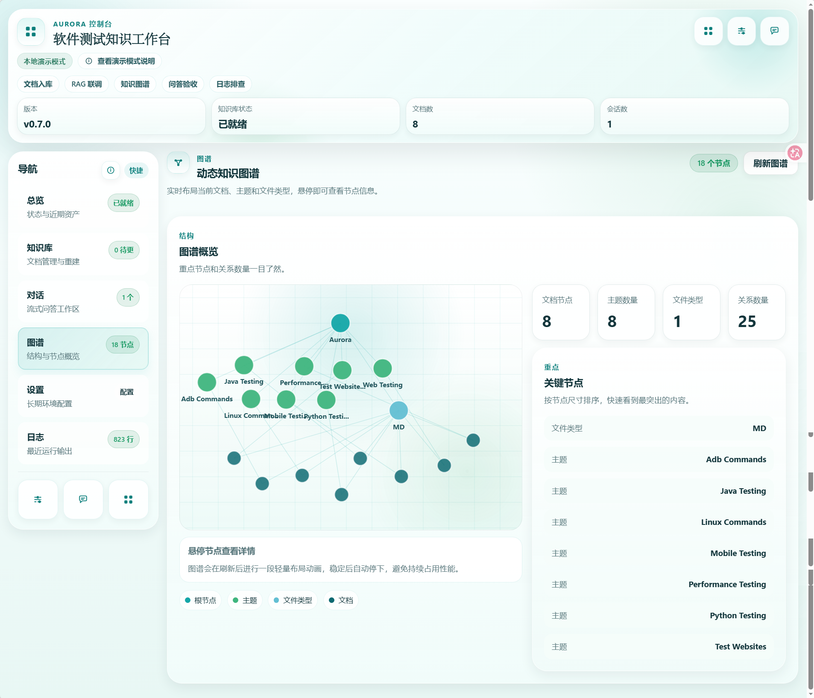
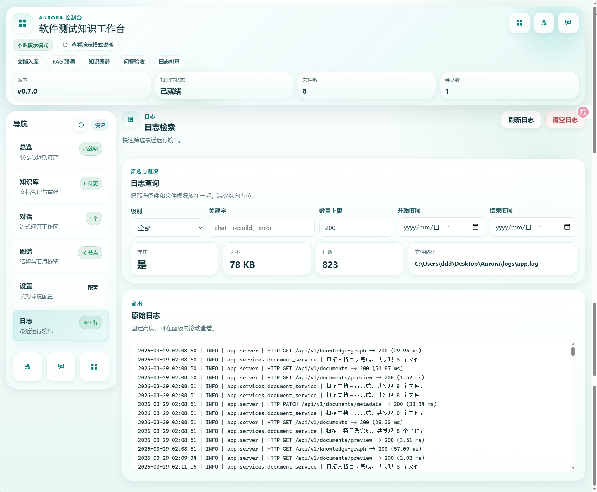

# Aurora

[](https://www.python.org/)
[](https://fastapi.tiangolo.com/)
[](https://react.dev/)
[](https://vite.dev/)
[](https://www.trychroma.com/)

Aurora 是一个面向软件测试知识场景的本地 AI 工作台，把文档入库、知识库重建、RAG 问答、知识图谱、日志排查和配置联调整合到一个控制台里。

它适合把测试规范、排障手册、ADB 命令、Linux 命令、Web / 移动端测试资料沉淀成一个可检索、可追问、可维护的内部知识库。

当前版本：`v0.7.0`

---

## 📚 目录导航

- 🚀 项目简介
- ✨ 核心特性
- 🖼️ 界面预览
- 🎯 适用场景
- 🧭 推荐工作流
- 🧪 本地演示模式
- 🤖 模型接入方式
- 🛠️ 技术栈
- ⚡ 快速开始
- ⚙️ 配置说明
- 🧱 项目结构
- 🪟 页面工作区
- ✅ 测试与构建
- 🕒 版本迭代
- 📌 当前状态
- 🔭 后续方向

---

## 🚀 项目简介

Aurora 不是单纯的聊天页面，也不是单纯的文件管理工具，而是一套围绕下面这条闭环设计的本地知识工作台：

`资料沉淀 -> 文档入库 -> 索引构建 -> 问答验证 -> 图谱浏览 -> 日志排查 -> 配置联调`

你可以把它理解成：

- 🧠 测试团队内部知识库控制台
- 🔍 RAG 问答效果验证平台
- 🛠️ 模型联调与知识库调试工作台
- 🧭 图谱与日志辅助排查入口

---

## ✨ 核心特性

| 模块 | 产品标签 | 能力 | 当前状态 |
| --- | --- | --- | --- |
| 文档管理 | 📄 内容整理 | 上传、预览、重命名、删除、主题标签维护、批量操作 | ✅ 已完成 |
| 知识库构建 | 🧱 索引构建 | `sync / scan / reset` 三种重建模式、切片统计、失败文档统计、任务状态查看 | ✅ 已完成 |
| RAG 问答 | 💬 效果验证 | 多会话、流式回答、引用来源、耗时展示、本地演示模式 | ✅ 已完成 |
| 知识图谱 | 🕸️ 结构洞察 | 按主题、文件类型、文档生成轻量图谱并浏览 | ✅ 已完成 |
| 设置与联调 | ⚙️ 配置控制 | `.env` 保存、多厂商预设、连通性测试、运行时覆盖 | ✅ 已完成 |
| 日志排查 | 🪵 问题定位 | 日志筛选、日志概况、固定高度滚动查看、清空日志 | ✅ 已完成 |

---

## 🖼️ 界面预览

| 页面 | 预览 |
| --- | --- |
| 总览 / 主控制台 |  |
| 知识库 / 控制台视图 |  |
| 对话 / RAG 问答 |  |
| 图谱 / 关系视图 |  |
| 日志 / 设置页面 |  |

---

## 🎯 适用场景

| 场景 | 场景标签 | 适合做什么 | 对应页面 |
| --- | --- | --- | --- |
| 团队知识沉淀 | 🗂️ 知识运营 | 把测试规范、排障手册、命令集合和经验文档沉淀到知识库 | 知识库 |
| RAG 联调 | 🔍 检索验证 | 验证切片、检索、引用和回答链路是否有效 | 知识库 / 对话 / 日志 |
| 问答验收 | 🧪 结果验收 | 用真实测试资料验证回答质量与引用可信度 | 对话 |
| 图谱辅助理解 | 🧭 结构理解 | 看知识覆盖范围、主题聚类和资料结构关系 | 图谱 |
| 日志排查 | 🚨 故障排查 | 排查建库、问答、模型调用、配置异常 | 日志 |

---

## 🧭 推荐工作流

1. 准备资料  
把测试资料放入 `data/` 目录，或者在“知识库”页面直接上传。

2. 配置模型  
长期配置放在“设置”页保存到 `.env`；临时联调使用运行时请求头覆盖。

3. 重建知识库  
根据需要选择 `sync`、`scan` 或 `reset`，系统会扫描文档、切片并写入索引。

4. 进入对话验证  
在“对话”页提问，观察回答、引用来源和耗时是否符合预期。

5. 查看图谱与日志  
在“图谱”页检查知识结构，在“日志”页排查建库或问答异常。

---

## 🧪 本地演示模式

当未配置完整的 LLM / Embedding 密钥时，Aurora 会进入“本地演示模式”。

此模式下仍可完成：

- 📄 文档上传、预览、重命名、删除和元数据维护
- 🧱 知识库重建与本地索引更新
- 💬 本地抽取式问答
- 🕸️ 图谱浏览
- ⚙️ 设置维护与连通性测试
- 🪵 日志查询与排查

适合用于：

- 本地试用
- 前后端联调
- 功能验收
- 演示流程走查

---

## 🤖 当前支持的模型接入方式

### 后端主接入方式

- `openai`
- `openai_compatible`

### 前端预设支持

- `openai`
- `openai_compatible`
- `deepseek`
- `qwen`
- `zhipu`
- `moonshot`
- `siliconflow`
- `openrouter`

说明：

- 前端预设的目标是提升联调效率
- 当前后端主链路仍以 `OpenAI` / `OpenAI Compatible` 为核心
- 其他预设更偏向快速填写模型参数，而不是全部都做了独立后端适配

---

## 🛠️ 技术栈

### 后端

- Python 3.11+
- FastAPI
- Uvicorn
- Chroma
- 本地 JSON 索引兜底

### 前端

- React 18
- Vite 7
- Vitest
- Playwright

---

## ⚡ 快速开始

### 环境要求

| 项目 | 要求 |
| --- | --- |
| 🐍 Python | 3.11+ |
| 🟢 Node.js | 20+ |
| 📦 npm | 10+ |

### 一键启动

Windows:

```powershell
.\start.ps1
```

Linux / macOS:

```bash
chmod +x start.sh
./start.sh
```

启动脚本会自动完成：

- 创建 `.venv`
- 创建 `.env`
- 安装后端依赖
- 安装前端依赖
- 构建前端
- 启动 FastAPI 服务

默认访问地址：

| 地址 | 用途 | 说明 |
| --- | --- | --- |
| `http://127.0.0.1:8000` | 🏠 应用入口 | Aurora 页面 |
| `http://127.0.0.1:8000/health` | ❤️ 健康检查 | 服务状态检查 |
| `http://127.0.0.1:8000/docs` | 📘 API 文档 | FastAPI Swagger |

### 手动安装

```powershell
python -m venv .venv
.\.venv\Scripts\activate
pip install -r requirements.txt

cd frontend
npm install
cd ..
```

### 手动启动后端

```powershell
.\.venv\Scripts\python.exe -m uvicorn app.server:app --host 127.0.0.1 --port 8000
```

### 手动启动前端开发模式

```powershell
cd frontend
npm run dev
```

开发模式前端地址：

- `http://127.0.0.1:5173/`

---

## ⚙️ 配置说明

项目首次启动时会自动创建 `.env`。常用配置如下：

| 配置项 | 类型 | 说明 |
| --- | --- | --- |
| `LLM_PROVIDER` | 🤖 模型提供方 | 聊天模型提供方 |
| `EMBEDDING_PROVIDER` | 🧠 向量提供方 | 向量模型提供方 |
| `LLM_MODEL` | 💬 模型名 | 聊天模型名称 |
| `EMBEDDING_MODEL` | 🔎 模型名 | 向量模型名称 |
| `LLM_API_BASE` | 🌐 接口地址 | 聊天模型接口地址 |
| `EMBEDDING_API_BASE` | 🌐 接口地址 | 向量模型接口地址 |
| `LLM_API_KEY` | 🔐 密钥 | 聊天模型密钥 |
| `EMBEDDING_API_KEY` | 🔐 密钥 | 向量模型密钥 |
| `CHUNK_SIZE` | ✂️ 切片参数 | 切片大小 |
| `CHUNK_OVERLAP` | ✂️ 切片参数 | 切片重叠长度 |
| `TOP_K` | 🔍 检索参数 | 检索召回数量 |
| `MAX_HISTORY_TURNS` | 🧾 会话参数 | 最大上下文轮数 |
| `LOG_LEVEL` | 🪵 日志参数 | 日志级别 |
| `API_HOST / API_PORT` | 🚪 服务参数 | 服务监听地址与端口 |

推荐做法：

- 长期稳定配置保存在 `.env`
- 临时联调使用前端“运行时联调”覆盖，不污染 `.env`
- 团队部署时优先由服务端统一注入密钥

---

## 🧱 项目结构

```text
Aurora/
├─ app/
│  ├─ api/
│  │  ├─ dependencies.py
│  │  ├─ request_models.py
│  │  ├─ serializers.py
│  │  └─ routes/
│  ├─ services/
│  ├─ config.py
│  ├─ llm.py
│  ├─ logging_config.py
│  ├─ schemas.py
│  └─ server.py
├─ frontend/
│  ├─ src/
│  ├─ tests/
│  ├─ playwright.config.js
│  └─ package.json
├─ tests/
├─ docs/
│  ├─ assets/screenshots/
│  ├─ ARCHITECTURE_FRAMEWORK.md
│  ├─ P0_ACCEPTANCE_REPORT.md
│  ├─ SECURITY_PENDING.md
│  └─ UNFINISHED_BACKLOG.md
├─ data/
├─ db/
├─ logs/
├─ requirements.txt
├─ start.ps1
├─ start.sh
└─ README.md
```

---

## 🪟 当前页面工作区

| 页面 | 页面标签 | 作用 |
| --- | --- | --- |
| 总览 | 🏠 控制台 | 查看应用状态、知识库状态、模型接入情况 |
| 知识库 | 📚 资料中心 | 上传资料、批量管理文档、重建索引、预览文档 |
| 对话 | 💬 验证中心 | 用真实资料做问答验证、引用核查和效果验收 |
| 图谱 | 🕸️ 关系视图 | 查看主题、类型和文档之间的结构关系 |
| 设置 | ⚙️ 配置中心 | 保存 `.env`、切换模型参数、做连通性测试 |
| 日志 | 🪵 排查中心 | 筛选与排查建库、问答、配置相关日志 |

---

## ✅ 测试与构建

### 后端测试

```powershell
python -m unittest discover -s tests -v
```

### 前端单元测试

```powershell
cd frontend
npm test -- --run
```

### 前端构建

```powershell
cd frontend
npm run build
```

### Playwright 验收

```powershell
cd frontend
npx playwright test tests/p1-acceptance.spec.js --config=playwright.config.js --reporter=line
```

---

## 🕒 版本迭代

### P0：可运行原型阶段

这个阶段的目标是把主链路先跑通，做到“能启动、能建库、能问答、能排查”。

阶段特征：

- 📄 本地文档入库
- 🧱 基础知识库重建
- 💬 本地演示模式问答
- 🕸️ 知识图谱浏览
- ⚙️ 设置页与日志页

对应文档：

- [P0 验收报告](./docs/P0_ACCEPTANCE_REPORT.md)

### P1：工程化与可维护性补强

这个阶段重点不再是单纯加功能，而是把系统从“能跑”推进到“更稳、更好维护”。

阶段特征：

- 🧩 后端路由拆分到 `app/api/routes/`
- 🧾 补充 `dependencies / request_models / serializers`
- 🆔 文档操作从路径语义切换到 `document_id`
- 💾 知识库任务持久化到 `db/knowledge_base_jobs.json`
- ✅ API 测试、前端 API 测试和 Playwright 验收补齐

### v0.3.x：基础工作台成型

这个阶段开始把“后端链路可用”推进到“前端工作台可用”。

阶段特征：

- 🏠 总览、知识库、对话、图谱、设置、日志六大页面成型
- 🧪 本地演示模式可以覆盖主要验收场景
- 🔗 文档、问答、图谱、日志开始完整串联

### v0.5.x：任务体系与验收能力增强

这个阶段重点是把“重建任务”和“验收链路”做得更完整。

阶段特征：

- 🧱 知识库任务状态更完整
- 👀 失败状态与处理结果更可观察
- ✅ 前后端测试体系逐步补齐
- 🧪 页面级验收链路建立

### v0.6.x：控制台体验优化

这个阶段开始聚焦工作台体验、信息密度和高频操作效率。

阶段特征：

- 📚 知识库页更适合高频操作
- 💬 对话页更聚焦问答验证
- ⚙️ 设置与日志页布局更紧凑
- 🪟 知识库任务状态窗体验持续优化

### v0.7.0：工作台整合与性能优化

当前版本在前面基础上，重点做了工作台整合与首屏性能优化。

阶段特征：

- 🚀 新增知识库重建三种模式：`sync / scan / reset`
- 🛡️ 修复知识库任务悬浮窗遮挡操作问题
- 🔗 新增首屏聚合接口 `/api/v1/system/bootstrap`
- ⚡ 首屏从多次重复请求收敛为聚合请求
- 👀 文档预览改为按需加载，降低首屏隐藏请求
- 🗂️ README、目录结构和文档统一整理到 `docs/`

### 下一阶段：v0.8.x 方向

计划重点：

- 🧩 继续拆分 `frontend/src/App.jsx`
- 🧠 为 `bootstrap` 增加缓存策略
- 🔁 增强任务恢复、重试与治理能力
- 🔐 完善团队化部署所需的权限、密钥治理和审计能力

---

## 📌 当前状态

当前仓库已经不是早期原型，而是进入了“主链路完整 + 工程化持续补强”的阶段。

已落地：

- ✅ 可启动、可建库、可问答、可看图谱、可配置、可查日志
- ✅ 后端 API 模块化
- ✅ 文档 `document_id` 化
- ✅ 知识库任务持久化
- ✅ `sync / scan / reset` 三种重建模式
- ✅ API + 前端单测 + Playwright 验收
- ✅ 首屏聚合接口与一轮性能优化

---

## 🔭 后续优化方向

- 继续拆分 `frontend/src/App.jsx`
- 为 `bootstrap` 增加更稳妥的缓存策略
- 继续增强任务恢复、重试与治理能力
- 扩展更多模型提供方的后端适配
- 完善团队化部署所需的权限、密钥治理和审计能力

---

## 📎 相关文档

- [架构框架](./docs/ARCHITECTURE_FRAMEWORK.md)
- [未完成待办](./docs/UNFINISHED_BACKLOG.md)
- [安全待处理项](./docs/SECURITY_PENDING.md)
- [P0 验收报告](./docs/P0_ACCEPTANCE_REPORT.md)

---

## 📄 License

当前仓库尚未单独声明 License；如果后续需要开源发布，建议补充明确的许可证文件。
