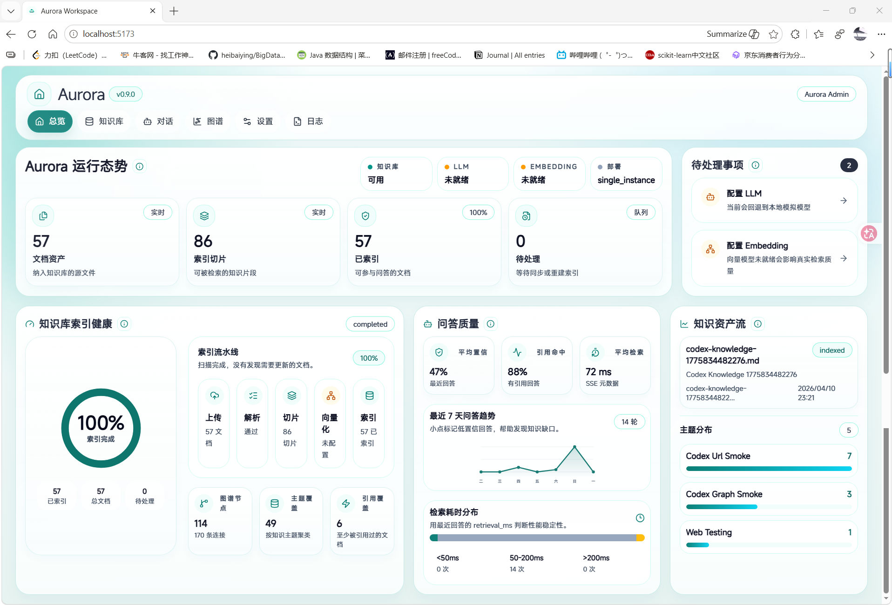
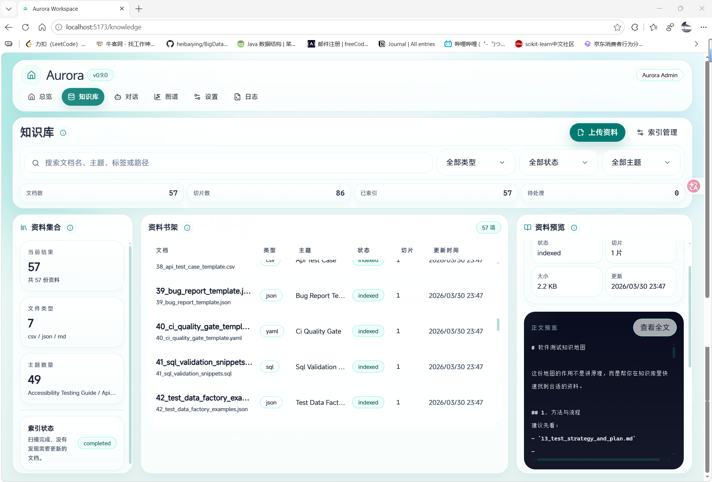
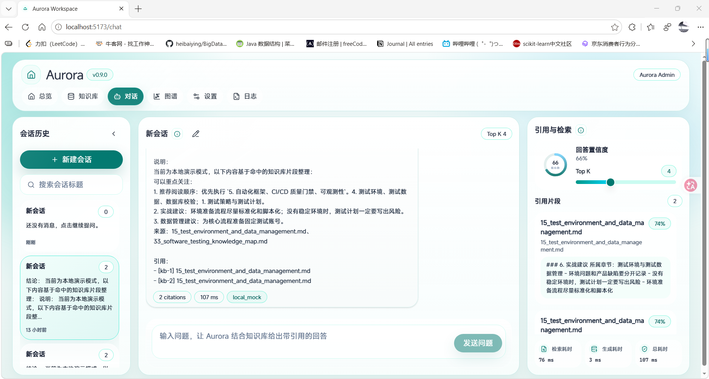
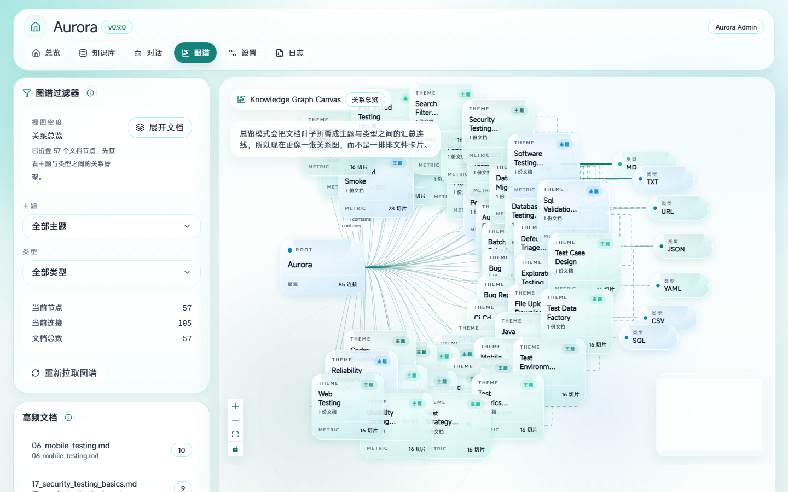
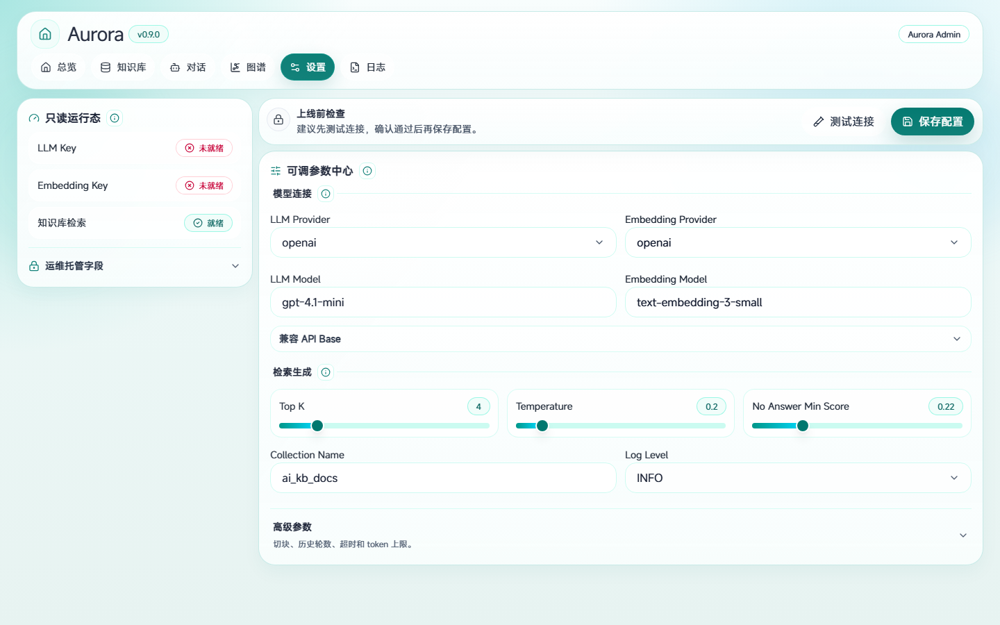
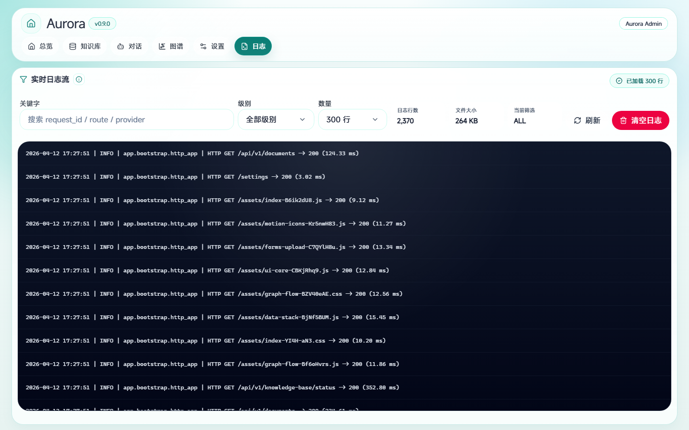

# Aurora v0.9.0 🚀

[](#)
[](https://www.python.org/)
[](https://fastapi.tiangolo.com/)
[](https://react.dev/)
[](https://vite.dev/)
[](https://www.docker.com/)
[](https://playwright.dev/)

> 把资料变成答案，把经验变成团队可复用能力。  
> Aurora 是一个面向知识沉淀、RAG 验证、问答验收与运行治理的 AI 工作台，已经从本地 Demo 进化到支持团队试点的共享部署基线。✨

Aurora 不是“再做一个聊天框”，而是把这些动作收进同一个工作台里：

- 📥 接入和管理知识资产
- 🧠 构建混合检索知识库
- 💬 验证回答、引用、耗时和召回质量
- 🕸️ 从图谱视角看知识覆盖和缺口
- 🔧 联调 Provider / Embedding / 参数
- 📜 通过日志、审计和健康检查定位问题

如果你是测试、研发、交付、AI 应用或知识治理团队，Aurora 提供的不只是“像答案的回答”，而是一条 **可验证、可追踪、可治理、可部署** 的工作流。

---

## 🆕 v0.9.0 更新亮点

| 方向 | 这次升级了什么 |
| --- | --- |
| 🔐 共享内测门槛 | 业务 API 走服务端认证上下文，`internal` 路由收口为管理员权限，浏览器不再透传模型密钥 |
| 🛡️ 运行治理 | 配置中心区分可在线修改参数与运维注入密钥，关键拒绝与管理动作进入应用审计 |
| 📦 上传防护 | 新增文件大小上限、MIME 校验、恶意文件隔离区和并发护栏 |
| 🚦 主链路保护 | 聊天、上传、知识库重建、日志查询、provider dry-run 增加限流与并发控制 |
| 🚢 部署能力 | 新增 `Dockerfile`、`docker-compose.yml`、备份恢复脚本、`/health` 和 `/ready` |
| ✅ 验收闭环 | 新增 `verify.ps1` / `verify.sh`，Playwright 改为自带 `webServer` 冷启动验收 |

---

## 🌟 一眼看懂 Aurora

你输入：

```text
ADB 怎么查看当前前台 Activity？
```

Aurora 不只是返回一句话，还会把下面这些信息一起交给你：

- 可直接执行的答案建议
- 对应的知识片段引用
- 检索耗时、生成耗时、总耗时
- 当前 Top K、置信度与检索细节

你再输入：

```text
弱网场景下的移动端测试，应该优先关注什么？
```

Aurora 可以继续基于团队沉淀资料，给出：

- 测试重点项
- 检查清单
- 对应文档片段
- 多轮上下文下的连续回答

它特别适合这些资料：

- 测试策略 / 测试计划 / 需求评审纪要
- FAQ / 排障手册 / 值班手册 / 发布手册
- API 文档 / SQL 片段 / 命令清单
- ADB / Linux / Web / 移动端经验文档
- JSON / YAML / CSV / URL 快捷方式

---

## ✨ 核心能力

| 模块 | 你能做什么 | 当前状态 |
| --- | --- | --- |
| 总览工作台 | 看模型接入、知识库状态、待处理项、活跃会话、最近文档 | ✅ 可用 |
| 知识库 | 上传、预览、重命名、删除、批量处理、维护主题和标签 | ✅ 可用 |
| 索引任务 | 执行 `rebuild / sync / scan / reset`，查看索引健康状态 | ✅ 可用 |
| 对话工作台 | 多会话问答、流式响应、引用展示、检索细节、Top K 调整 | ✅ 可用 |
| 图谱工作台 | 查看主题、文件类型、文档节点与结构分布 | ✅ 可用 |
| 设置工作台 | 配置 Provider、模型、Embedding、Chunk、Top K、超时等参数 | ✅ 可用 |
| 日志工作台 | 按关键字、级别、时间范围过滤运行日志 | ✅ 可用 |
| 演示模式 | 在 LLM / Embedding 未完整接入时验证主流程 | ✅ 可用 |

---

## 🔐 团队试点默认边界

Aurora `v0.9.0` 默认按“内网共享部署”思路收口了几条关键边界：

- 未登录用户不能直接访问业务主链路
- 管理动作必须经过服务端权限判断，而不是浏览器自报身份
- `internal` 路由默认是管理员能力，不再是“带个 header 就放行”
- 浏览器侧不再透传 `X-LLM-API-Key`、`X-Embedding-API-Key` 一类敏感头
- 上传文件带大小限制、MIME 校验和隔离区
- 关键管理动作与权限拒绝会留下审计记录

这让 Aurora 更适合团队试点，而不只是单人本地玩具。🧩

---

## 🖼️ 页面预览

以下预览图由 Playwright 从当前运行界面采集，图片统一放在 [`image/`](./image/) 目录。

| 页面 | 预览 |
| --- | --- |
| 总览 / 工作台 |  |
| 知识库 / 文档管理 |  |
| 对话 / 问答工作台 |  |
| 图谱 / 结构视图 |  |
| 模型设置 |  |
| 日志 / 运行诊断 |  |

---

## 🚀 快速开始

### 环境要求

| 项目 | 要求 |
| --- | --- |
| Python | 3.11+ |
| Node.js | 20+ |
| npm | 10+ |
| Docker | 可选，推荐团队试点使用 |

### 方式 A：本地一键启动 ⚡

Windows:

```powershell
.\start.ps1
```

Linux / macOS:

```bash
chmod +x start.sh
./start.sh
```

### 方式 B：Docker Compose 启动 🐳

Windows:

```powershell
Copy-Item .env.example .env
docker compose up --build
```

Linux / macOS:

```bash
cp .env.example .env
docker compose up --build
```

### 手动启动后端

```powershell
.\.venv\Scripts\python.exe -m uvicorn app.bootstrap.http_app:app --host 127.0.0.1 --port 8000
```

### 手动启动前端

```powershell
npm --prefix frontend run dev
```

### 默认访问地址

| 地址 | 用途 |
| --- | --- |
| `http://127.0.0.1:8000` | 应用入口 |
| `http://127.0.0.1:8000/health` | 存活检查 |
| `http://127.0.0.1:8000/ready` | 就绪检查 |
| `http://127.0.0.1:8000/docs` | Swagger API 文档 |
| `http://127.0.0.1:5173/` | 前端开发模式 |

---

## ✅ 验收与测试

### 一套命令跑完整验收

Windows:

```powershell
.\verify.ps1
```

Linux / macOS:

```bash
./verify.sh
```

### 分项执行

后端 API 集成测试：

```powershell
python -m unittest tests.test_api_routes tests.test_services
```

前端单测：

```powershell
npm --prefix frontend run test
```

Playwright 冷启动验收：

```powershell
npm --prefix frontend run test:e2e
```

这套验收重点覆盖：

- 未登录访问
- 越权访问
- 跨项目访问
- 管理员操作
- 配置审计
- 上传限制
- 并发重建拦截

---

## 📚 使用方式

### Step 1. 接入资料 📥

把文档放进 `data/`，或者在知识库页面直接上传。

当前支持：

- `pdf`
- `docx`
- `xlsx`
- `html / htm`
- `url`
- `txt`
- `md`
- `csv`
- `json`
- `yaml / yml`
- `sql`

### Step 2. 构建索引 🧱

根据场景选择：

- `sync`：同步已有 catalog 和知识资产
- `scan`：扫描变化并增量更新
- `rebuild`：重建知识库
- `reset`：全量重置

### Step 3. 发起问答验证 💬

在对话页检查：

- 回答是否可靠
- 引用是否准确
- 检索是否合理
- 耗时是否可接受

### Step 4. 用图谱做治理 🕸️

在图谱页观察：

- 哪些主题覆盖强
- 哪些主题存在空白
- 哪些文件类型占比高
- 哪些文档需要关注

### Step 5. 做运行联调 🔧

在设置和日志页完成：

- Provider / Model / Embedding 配置
- Chunk / Top K / Timeout 调整
- 接口连通性测试
- 日志过滤与问题排查

---

## ⚙️ 配置说明

Aurora 现在把配置分成两类：

- 可在线调整的非敏感参数：如 `TOP_K`、`CHUNK_SIZE`、`LLM_TIMEOUT`
- 仅运维注入的敏感配置：如 `LLM_API_KEY`、`EMBEDDING_API_KEY`、监听地址和 CORS 白名单

常用环境变量：

| 配置项 | 说明 |
| --- | --- |
| `LLM_PROVIDER` / `EMBEDDING_PROVIDER` | 模型和向量模型提供方 |
| `LLM_MODEL` / `EMBEDDING_MODEL` | 具体模型名称 |
| `LLM_API_BASE` / `EMBEDDING_API_BASE` | 接口地址 |
| `LLM_API_KEY` / `EMBEDDING_API_KEY` | 运维注入密钥 |
| `CHUNK_SIZE` / `CHUNK_OVERLAP` | 文本切片参数 |
| `TOP_K` | 检索召回数量 |
| `MAX_HISTORY_TURNS` | 多轮上下文轮数 |
| `LLM_TIMEOUT` | 模型请求超时 |
| `LLM_MAX_TOKENS` | 生成上限 |
| `LOG_LEVEL` | 日志级别 |
| `CORS_ORIGINS` | 内网白名单域名 |
| `UPLOAD_MAX_FILE_BYTES` | 上传大小上限 |
| `UPLOAD_QUARANTINE_DIR` | 上传隔离目录 |

当前支持的 Provider：

- `openai`
- `openai_compatible`
- `deepseek`
- `qwen`
- `zhipu`
- `moonshot`
- `siliconflow`
- `openrouter`
- `local_mock`

推荐直接从 [`.env.example`](./.env.example) 起步。📄

---

## 🗺️ Roadmap

- 🎛️ 继续保持 `frontend/src/app/app.tsx` 壳层化，降低工作台页面之间的耦合
- 🧱 继续把后端 `services` 收敛到 `modules / infrastructure / shared`
- 🧪 扩大团队试点验收覆盖，补更完整的 API + E2E 场景
- ♻️ 把知识库任务推进到更可恢复的后台任务模型
- 🏢 继续增强团队能力：权限、审计、共享视图、运维治理

---

## 🔗 更多文档

- [README_INTERNAL.md](./README_INTERNAL.md)
- [共享部署阶段 0 基线](./docs/PHASE0_SHARED_DEPLOYMENT_BASELINE.md)
- [架构框架](./docs/ARCHITECTURE_FRAMEWORK.md)
- [Python 后端重分类与保护建议](./docs/PYTHON_BACKEND_RECLASSIFICATION_AND_PROTECTION.md)
- [Provider Independence Technical Route](./docs/PROVIDER_INDEPENDENCE_TECHNICAL_ROUTE.md)
- [安全待处理项](./docs/SECURITY_PENDING.md)
- [未完成 Backlog](./docs/UNFINISHED_BACKLOG.md)

---

## 📄 License

当前仓库尚未单独声明 License。  
如果后续需要开源发布，建议补充明确的许可证文件。📝
