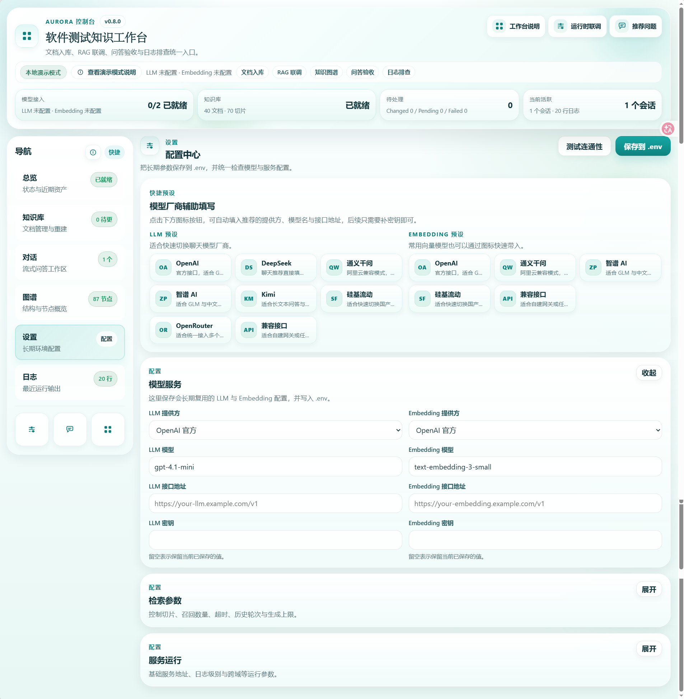

# Aurora

[](https://www.python.org/)
[](https://fastapi.tiangolo.com/)
[](https://react.dev/)
[](https://vite.dev/)
[](https://www.trychroma.com/)

把资料变成答案，把经验变成可复用能力。

Aurora 是一个面向知识沉淀、问答验证和运维排障的本地 AI 工作台。它把文档管理、知识库构建、检索增强问答、图谱浏览、日志排查和运行配置放进同一个界面里，让团队不再在文件夹、聊天记录、临时命令和零散经验之间来回切换。

如果你正在维护测试规范、交付手册、ADB 或 Linux 命令、Web 或移动端排障经验、FAQ、项目知识库，或者希望把测试清单、缺陷模板、发布门禁和 SQL 校验片段一起沉淀下来，Aurora 更适合被理解成一个“能跑起来、能查得到、能持续维护”的团队工作台，而不只是一个聊天页面。

当前版本：`v0.8.0`

---

## ✨ Aurora 能帮你做什么

- `📚` 把散落在 `data/`、本地文档和团队资料里的内容收拢起来，形成统一知识入口。
- `🧱` 用 `sync`、`scan`、`reset` 三种重建模式管理知识库，不必每次都从头来过。
- `💬` 在对话工作区里直接提问，查看引用来源、响应耗时和多轮会话结果，判断回答是否真的可靠。
- `🕸️` 通过图谱视图理解知识结构，而不是只盯着一条条文本回答。
- `🛠️` 在设置页维护运行参数和模型接入，在日志页快速定位构建、检索和联调问题。

---

## 🧭 为什么它更像工作台

Aurora 的重点不是“把模型接进来”，而是把一整条业务链路整理顺：

`资料整理 -> 文档入库 -> 索引构建 -> 问答验证 -> 结构洞察 -> 运行排障 -> 配置联调`

这意味着它既适合做知识沉淀，也适合做验证、联调和日常维护。你可以把它当成：

- 测试团队的内部知识台
- RAG 问答效果验证台
- 本地模型接入与配置联调台
- 日志排障与结构洞察辅助台

---

## 🚀 核心能力

| 模块 | 你可以得到什么 | 当前状态 |
| --- | --- | --- |
| 文档管理 | 上传、预览、重命名、删除、标签维护、批量操作 | 可用 |
| 知识库重建 | `sync`、`scan`、`reset` 三种模式，附带任务状态和结果反馈 | 可用 |
| 对话工作区 | 多会话、流式问答、引用来源、耗时展示、连续问答体验 | 可用 |
| 图谱浏览 | 查看主题、文件类型、文档节点和关系概览 | 可用 |
| 设置中心 | 保存 `.env`、维护模型参数、测试连通性 | 可用 |
| 日志排查 | 查看运行日志、按级别和关键词筛选、快速定位问题 | 可用 |
| 本地演示模式 | 未接入完整远端能力时，仍可验证主要流程 | 可用 |

---

## 📦 开箱即用的知识资产

Aurora 现在不只适合“放文档”，也适合沉淀一套能直接被团队复用的测试资料库。

- 覆盖常见软测主题：测试策略、需求分析、接口测试、性能测试、安全测试、可观测性、回归发布、缺陷管理、测试度量等。
- 支持放入可直接执行的模板资产：测试用例模板、缺陷报告模板、CI 质量门禁示例、SQL 校验片段、测试数据工厂示例、缺陷分级决策树等。
- 不再局限于 Markdown，知识库现在适合接收 `PDF / TXT / MD / CSV / JSON / YAML / SQL` 这类常见文本与资料格式。

这意味着它既能装“说明文档”，也能装“真正会被团队反复拿来用的模板和检查清单”。

---

## 🪜 典型使用方式

1. 把资料放到 `data/` 目录，或直接在知识库页面上传文档。
2. 在设置页完成模型、向量和接口地址配置。
3. 把规范、FAQ、检查清单、模板文件和结构化测试资料一起纳入同一个知识库。
4. 根据需要执行 `sync`、`scan` 或 `reset`。
5. 在对话页提出真实问题，检查回答、引用和耗时是否符合预期。
6. 在图谱页查看结构覆盖情况，在日志页排查异常和失败原因。

这套路径更适合真实业务联调，而不是只做一次性的演示。

---

## 🖼️ 界面预览

| 页面 | 预览 |
| --- | --- |
| 总览 / 工作台 |  |
| 知识库 / 文档管理 |  |
| 对话 / 问答工作区 |  |
| 图谱 / 结构视图 |  |
| 模型设置 |  |
| 日志 / 设置 |  |

---

## ⚡ 三分钟跑起来

### 环境要求

| 项目 | 要求 |
| --- | --- |
| Python | 3.11+ |
| Node.js | 20+ |
| npm | 10+ |

### 一键启动

Windows:

```powershell
.\start.ps1
```

Linux / macOS:

```bash
chmod +x start.sh
./start.sh
```

启动脚本会自动完成：

- 创建 `.venv`
- 从 `.env.example` 初始化 `.env`
- 安装后端依赖
- 安装前端依赖
- 构建前端
- 启动 FastAPI 服务

默认访问地址：

| 地址 | 用途 |
| --- | --- |
| `http://127.0.0.1:8000` | 应用入口 |
| `http://127.0.0.1:8000/health` | 健康检查 |
| `http://127.0.0.1:8000/docs` | Swagger API 文档 |

支持的知识库文件类型：

- `pdf`
- `txt`
- `md`
- `csv`
- `json`
- `yaml / yml`
- `sql`

### 手动安装

```powershell
python -m venv .venv
.\.venv\Scripts\activate
pip install -r requirements.txt

cd frontend
npm install
cd ..
```

### 手动启动后端

```powershell
.\.venv\Scripts\python.exe -m uvicorn app.server:app --host 127.0.0.1 --port 8000
```

### 手动启动前端开发模式

```powershell
cd frontend
npm run dev
```

前端开发地址：

- `http://127.0.0.1:5173/`

---

## 🧩 页面与工作区

| 页面 | 适合做什么 |
| --- | --- |
| 总览 | 快速看应用状态、知识库状态、模型接入情况和关键目录 |
| 知识库 | 上传文档、管理资料、执行重建、查看任务结果和文档预览 |
| 对话 | 发起问题、验证回答质量、查看引用与多会话记录 |
| 图谱 | 浏览知识结构、节点分布和关系概览 |
| 设置 | 保存运行配置、测试连通性、维护长期参数 |
| 日志 | 查询日志、筛选输出、辅助定位问题 |

---

## ⚙️ 配置建议

项目首次启动时会自动生成 `.env`。常用配置大致分为以下几类：

| 配置项 | 说明 |
| --- | --- |
| `LLM_PROVIDER` / `EMBEDDING_PROVIDER` | 聊天模型与向量模型提供方 |
| `LLM_MODEL` / `EMBEDDING_MODEL` | 具体模型名称 |
| `LLM_API_BASE` / `EMBEDDING_API_BASE` | 接口地址 |
| `LLM_API_KEY` / `EMBEDDING_API_KEY` | 访问密钥 |
| `CHUNK_SIZE` / `CHUNK_OVERLAP` | 切片参数 |
| `TOP_K` | 检索召回数量 |
| `MAX_HISTORY_TURNS` | 对话上下文轮数 |
| `LOG_LEVEL` | 日志级别 |
| `API_HOST` / `API_PORT` | 服务监听地址与端口 |

建议这样使用：

- 稳定配置放在 `.env`
- 临时联调用页面设置覆盖，避免频繁改文件
- 团队部署时统一注入密钥和服务地址

---

## 🏗️ 技术栈

### 后端

- Python 3.11+
- FastAPI
- Uvicorn
- Chroma
- 本地 JSON 持久化与任务状态存储

### 前端

- React 18
- Vite 7
- Vitest
- Playwright

---

## 🗂️ 项目结构

```text
Aurora/
|-- app/
|   |-- api/
|   |   |-- dependencies.py
|   |   |-- request_models.py
|   |   |-- serializers.py
|   |   `-- routes/
|   |-- services/
|   |-- config.py
|   |-- llm.py
|   |-- logging_config.py
|   |-- schemas.py
|   `-- server.py
|-- frontend/
|   |-- src/
|   |-- tests/
|   |-- playwright.config.js
|   `-- package.json
|-- tests/
|-- docs/
|   |-- assets/screenshots/
|   |-- ARCHITECTURE_FRAMEWORK.md
|   |-- P0_ACCEPTANCE_REPORT.md
|   |-- PROVIDER_INDEPENDENCE_TECHNICAL_ROUTE.md
|   |-- SECURITY_PENDING.md
|   `-- UNFINISHED_BACKLOG.md
|-- data/
|-- db/
|-- logs/
|-- requirements.txt
|-- start.ps1
|-- start.sh
`-- README.md
```

---

## ✅ 测试与构建

后端测试：

```powershell
python -m unittest discover -s tests -v
```

前端单元测试：

```powershell
cd frontend
npm test -- --run
```

前端构建：

```powershell
cd frontend
npm run build
```

Playwright 验收：

```powershell
cd frontend
npx playwright test tests/p1-acceptance.spec.js --config=playwright.config.js --reporter=line
```

---

## 🆕 版本更新

### v0.8.0

这一版重点是把 Aurora 从“能跑”继续往“更顺手、更像产品、更适合真实业务使用”推进了一步：

- 对话链路与业务接入进一步收口，连续问答体验更稳定
- 公共接口继续保持克制，前端不需要感知额外内部实现
- 测试覆盖继续补强，后端、前端和验收链路更完整
- 知识库不再局限于基础文档，开始支持更适合团队沉淀的结构化资料与模板资产
- 文档接入格式进一步扩展，除了常见文档外，也能收纳 `CSV / JSON / YAML / SQL`
- README 重写为面向用户和产品体验的版本，降低理解门槛

### 当前阶段

Aurora 已经从早期原型逐步演进成一个可联调、可验证、可维护的本地 AI 工作台。接下来仍然值得持续投入的方向包括：

### 产品后续重点

- 把首次使用体验做顺：补齐新手引导、空状态说明、推荐操作路径和失败后的下一步提示，降低第一次上手成本。
- 把知识库从“能上传”推进到“更好运营”：增加模板包、批量治理、内容质量提示、导入导出和资料生命周期管理能力。
- 把问答页从“能问”推进到“能验”：增加回答反馈、引用质量判断、基准问题集和效果对比，方便做 RAG 验收。
- 把图谱和文档页从“展示信息”推进到“支持决策”：让用户更快发现资料空白、重复内容、低质量内容和主题覆盖不足。
- 补强团队协作能力：后续需要考虑多项目隔离、角色权限、共享资料视图、操作审计和团队配置复用。
- 增加更贴近业务的 Agent 工作流：例如测试资料整理、发布检查、排障分析、知识补全和结果复盘等场景化入口。

### 技术后续重点

- 前端继续拆分大组件，逐步把知识库、对话、设置、日志这些区域拆成稳定模块，降低 `App.jsx` 的维护成本。
- 后端继续做服务分层，把知识库、检索、任务、治理和存储进一步解耦，减少 service 过厚和职责平铺的问题。
- 提升知识库任务系统：补齐任务恢复、失败重试、取消一致性、扫描结果追踪和更细粒度的进度反馈。
- 继续增强检索链路：优化切片策略、混合检索、重排、结构化资料召回、元数据过滤和场景化检索计划。
- 提升知识资产支持范围：后续可继续补充 `xlsx / docx / html / xml` 等常见资料格式，以及更稳定的结构化内容解析。
- 完善工程化与部署能力：增加 Docker 化、环境模板、备份恢复、灰度配置、健康检查和更清晰的部署说明。
- 加强安全与治理：补齐鉴权、权限边界、密钥治理、审计记录、限流和高风险操作保护。
- 继续补强测试体系：扩大前端交互验收、后端回归覆盖、知识库真实样本测试和性能基线测试。

---

## 📎 相关文档

- [架构框架](./docs/ARCHITECTURE_FRAMEWORK.md)
- [Provider Independence Technical Route](./docs/PROVIDER_INDEPENDENCE_TECHNICAL_ROUTE.md)
- [P0 验收报告](./docs/P0_ACCEPTANCE_REPORT.md)
- [安全待处理项](./docs/SECURITY_PENDING.md)
- [未完成待办](./docs/UNFINISHED_BACKLOG.md)

说明：

- `docs/` 中保留了若干实现与技术路线文档，适合研发团队内部继续演进时参考
- README 以项目价值、使用路径和体验说明为主，不展开内部技术细节

---

## 📄 License

当前仓库尚未单独声明 License。如后续需要开源发布，建议补充明确的许可证文件。
