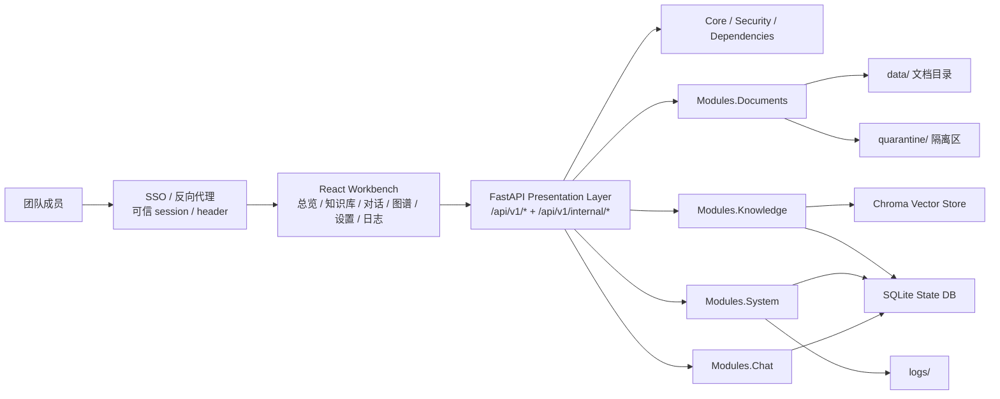
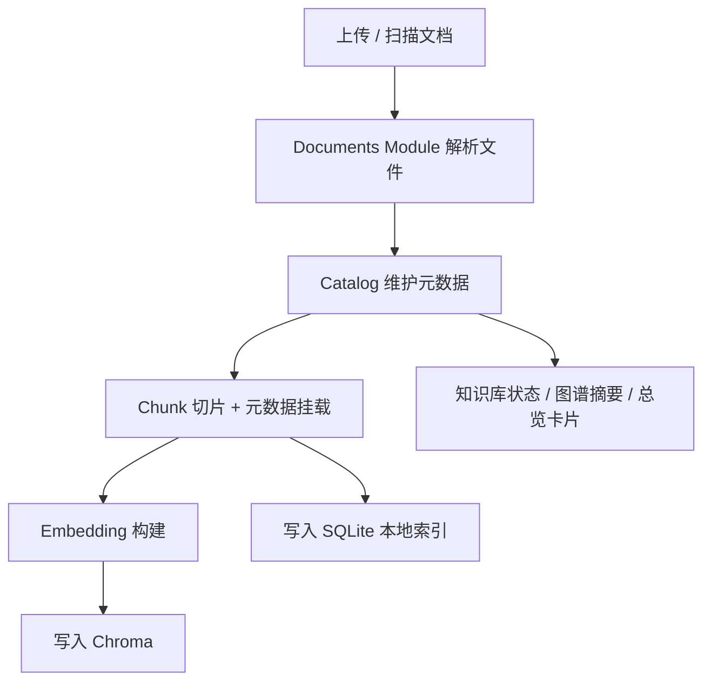
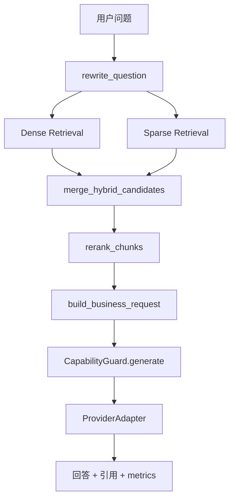

# Aurora Internal README v0.9.0 🧠

> 面向研发、产品、架构、测试和交付的内部说明文档。  
> 目标：说明 Aurora `v0.9.0` 当前的产品形态、分层结构、安全边界、治理能力和下一迭代重点。🚦

---

## 🆕 v0.9.0 迭代快照

| 方向 | 本版状态 |
| --- | --- |
| 架构落点 | `bootstrap / core / presentation / modules / infrastructure / shared` 已落目录，旧路径仍保留兼容层 |
| 共享内测基线 | 公共路由走认证上下文，`internal` 路由按管理员能力收口，浏览器侧模型密钥透传已移除 |
| 运行治理 | 配置区分在线参数与运维密钥，应用审计、限流和并发护栏进入主链路 |
| 上传安全 | 文件大小上限、MIME 校验、恶意文件隔离目录已落地 |
| 部署与验收 | `Dockerfile`、`docker-compose.yml`、备份恢复脚本、`verify.ps1` / `verify.sh` 已补齐 |
| 仍待推进 | 前端工作台继续细拆、`schemas.py` 继续拆分、知识库后台任务可恢复模型仍未做完 |

---

## 🗂️ 文档导航

| 章节 | 内容 |
| --- | --- |
| 1 | 产品定位与边界 |
| 2 | 当前代码结构 |
| 3 | 系统架构 |
| 4 | 核心业务流程 |
| 5 | 安全与治理基线 |
| 6 | API 分层 |
| 7 | 数据、部署与运维 |
| 8 | 测试与验收 |
| 9 | 当前约束 |
| 10 | 下一迭代建议 |

快速跳转：

- [1. 产品定位与边界](#1-产品定位与边界)
- [2. 当前代码结构](#2-当前代码结构)
- [3. 系统架构](#3-系统架构)
- [4. 核心业务流程](#4-核心业务流程)
- [5. 安全与治理基线](#5-安全与治理基线)
- [6. API 分层](#6-api-分层)
- [7. 数据部署与运维](#7-数据部署与运维)
- [8. 测试与验收](#8-测试与验收)
- [9. 当前约束](#9-当前约束)
- [10. 下一迭代建议](#10-下一迭代建议)

---

## 🖼️ 功能预览

以下截图由 Playwright 从当前运行界面采集，统一放在 [`image/`](./image/) 目录，便于内部评审、交付说明和版本验收复用。

| 页面 | 预览 |
| --- | --- |
| 总览 / 运行态势 |  |
| 知识库 / 资料书架 |  |
| 对话 / RAG 验收 |  |
| 图谱 / 资产结构 |  |
| 设置 / Provider 联调 |  |
| 日志 / 运行诊断 |  |

---

## 1. 产品定位与边界

Aurora 现在已经不是“单纯的聊天产品”，而是一个围绕知识资产运转的 AI 工作台。

### 1.1 对外价值 🎯

| 价值方向 | 说明 |
| --- | --- |
| 知识沉淀 | 把文档、FAQ、命令经验、测试资产统一接入 |
| RAG 验证 | 用真实问题验证回答、引用、耗时和召回效果 |
| 知识治理 | 从图谱和状态维度看知识覆盖、风险和缺口 |
| 工程联调 | 在一个界面里完成 Provider、Embedding、日志、运行参数和任务联排 |

### 1.2 对内角色 🧩

| 角色 | 说明 |
| --- | --- |
| 知识资产入口 | 文档接入、预览、标签、主题、状态维护 |
| RAG 验收台 | 问答、引用、检索细节、耗时、置信度 |
| 图谱治理台 | 主题分布、类型分布、重点文档、待关注资产 |
| 联调诊断台 | 设置、Provider、日志、任务健康 |
| 治理能力外壳 | 审计、权限、保留策略、安全事件等能力的承载层 |

### 1.3 当前明确边界 🚧

| 已形成共识 | 暂未做完 |
| --- | --- |
| 模块化单体后端 | 多实例任务恢复 |
| 混合检索 RAG | 前端彻底模块化拆分 |
| 共享内测安全基线 | 严格语义知识图谱 |
| 部署与验收脚本 | `schemas.py` 的完全拆散 |

---

## 2. 当前代码结构

### 2.1 新的主结构 🧱

Aurora 正在从“功能堆叠”过渡到“分层明确的模块化单体”，当前主结构已经是：

| 目录 | 作用 |
| --- | --- |
| `app/bootstrap/` | HTTP 应用装配与启动入口 |
| `app/core/` | 配置、日志、核心安全与平台级基础能力 |
| `app/presentation/http/` | FastAPI 路由、依赖、请求模型、序列化器 |
| `app/modules/` | 按业务域组织的服务层 |
| `app/infrastructure/` | 持久化、索引等基础设施 |
| `app/shared/contracts/` | 共享契约与类型迁移承接层 |

### 2.2 当前主要落点 📍

| 目录 / 文件 | 当前职责 |
| --- | --- |
| `app/bootstrap/http_app.py` | FastAPI 入口、路由装配、`/health`、`/ready`、前端静态挂载 |
| `app/presentation/http/routes/*.py` | 公开路由与内部路由入口 |
| `app/modules/documents` | 文档、目录、物化、ETL 等文档域逻辑 |
| `app/modules/knowledge` | 知识库、检索、图谱、RAG 编排 |
| `app/modules/chat` | 会话、消息恢复等聊天域逻辑 |
| `app/modules/system` | 系统设置、健康、审计、连通性、并发控制 |
| `frontend/src/app/app.tsx` | 工作台路由壳层、权限导航和页面懒加载入口 |
| `frontend/src/api/client.ts` | 前端 API 调用层，当前已不再构造模型密钥透传头 |

### 2.3 兼容层现状 ♻️

当前还保留了一批旧入口作为兼容层：

- `app/server.py`
- `app/config.py`
- `app/api/*`
- `app/services/*`
- `app/schemas.py`

这意味着迁移方向已经明确，但 import 清理还没有彻底完成。

---

## 3. 系统架构

### 3.1 总体架构图 🏗️

### 3.2 运行特征 🧭

| 层次 | 当前实现特点 |
| --- | --- |
| Frontend | React 18 单页工作台，页面已按 `overview / knowledge / chat / graph / settings / logs` 拆分 |
| Presentation | 路由、依赖与请求模型开始稳定到 `presentation/http` |
| Modules | 聊天、文档、知识、系统四类主域已经出现明确目录 |
| Infrastructure | 持久化与索引在向独立目录收口 |
| Storage | SQLite + Chroma + 文件系统 + 隔离区 |
| Deploy | 本地脚本和 Docker Compose 两套启动路径并存 |

### 3.3 健康与可部署性 ✅

当前已经具备团队试点需要的基本运维面：

- `/health`：存活检查
- `/ready`：数据库表状态与就绪检查
- `docker-compose.yml`：单实例共享部署起点
- `scripts/backup_aurora.*`：备份脚本
- `scripts/restore_aurora.*`：恢复脚本

---

## 4. 核心业务流程

### 4.1 文档接入与索引 📥

### 4.2 问答链路 💬

### 4.3 管理与治理链路 🛡️

当前几个关键治理动作已经开始进入统一模式：

- 设置修改和设置测试：权限校验 + 审计 + 运维托管字段拒绝
- 知识库重建：限流 + 并发保护 + job in progress `409` + 审计
- 上传：大小限制 + MIME 校验 + 隔离区 + 并发保护
- Provider dry-run：限流 + 并发保护 + 审计
- 跨项目访问与权限拒绝：统一返回正确状态码并记录审计

---

## 5. 安全与治理基线

### 5.1 认证与角色模型 🔐

当前共享内测基线采用“服务端可信身份上下文”：

- 身份来自 SSO / 反向代理注入的可信 session 或 header
- 公共业务路由不再接受客户端自报 `user_id / team / role`
- `internal` 路由按管理员能力收口
- 当前冻结角色模型：`admin / operator / member / viewer`

### 5.2 数据隔离边界 🧭

当前隔离主轴是：

- `tenant_id`：部署级固定值
- `project_id`：业务主隔离边界
- `team_id`：团队归因与审计维度
- `user_id / session_id`：项目内细粒度隔离

服务端已经开始拦截用户伪造他人 `project / user / session` 上下文的访问。

### 5.3 配置边界 ⚙️

Aurora 现在把配置拆成两类：

- 可在线修改的非敏感参数
- 仅运维注入的敏感配置

已经明确不能从 UI 直接写入的典型字段：

- `LLM_API_KEY`
- `EMBEDDING_API_KEY`
- `API_HOST`
- `API_PORT`
- `CORS_ORIGINS`

### 5.4 上传防护 📦

上传主链路已经具备：

- 文件大小上限
- MIME 类型校验
- 被拒绝文件写入 `quarantine/`
- 上传并发护栏

### 5.5 审计与并发治理 📜

当前已经明确进入应用审计或主链路保护的能力包括：

- 权限拒绝
- 配置修改 / 配置测试失败
- 知识库重建触发与拒绝
- provider dry-run
- 聊天、上传、日志查询、重建的限流与并发保护

---

## 6. API 分层

### 6.1 公开 API 🌐

| 分类 | 示例接口 |
| --- | --- |
| 系统 | `/api/v1/system/overview`, `/api/v1/system/bootstrap` |
| 文档 | `/api/v1/documents`, `/upload`, `/preview`, `/rename` |
| 知识库 | `/api/v1/knowledge-base/status`, `/rebuild`, `/sync`, `/scan`, `/reset` |
| 对话 | `/api/v1/chat/ask`, `/api/v1/chat/stream` |
| 图谱 | `/api/v1/knowledge-graph` |
| 设置 | `/api/v1/settings`, `/api/v1/settings/test` |
| 日志 | `/api/v1/logs` |

### 6.2 内部 API 🧪

| 分类 | 示例接口 | 当前边界 |
| --- | --- | --- |
| Internal Chat | `/api/v1/internal/chat/sessions`, `/recover` | 管理能力 |
| Memory | `/api/v1/internal/memory/facts`, `/audit/*`, `/lifecycle/run` | 管理能力 |
| Providers | `/api/v1/internal/providers`, `/resolve`, `/dry-run` | 管理能力 |

### 6.3 分层目的

- 控制外部暴露面
- 保持治理能力只在受控入口开放
- 为后续平台化演进预留边界

---

## 7. 数据部署与运维

### 7.1 当前主要持久化对象 💾

| 介质 | 用途 |
| --- | --- |
| `data/` | 原始知识资产 |
| `quarantine/` | 被拒绝上传的隔离区 |
| SQLite State DB | 会话、消息、任务、审计、部分本地索引 |
| Chroma | 向量检索 |
| `logs/` | 应用运行日志 |
| `.env` | 运行配置与运维注入值 |

### 7.2 当前部署产物 🚢

| 文件 | 作用 |
| --- | --- |
| `Dockerfile` | 构建前端静态产物 + 后端运行镜像 |
| `docker-compose.yml` | 单实例共享部署模板 |
| `verify.ps1` / `verify.sh` | 一键验收脚本 |
| `scripts/backup_aurora.*` | 备份脚本 |
| `scripts/restore_aurora.*` | 恢复脚本 |

### 7.3 现阶段部署判断

Aurora 现在适合：

- 内网单实例共享部署
- 团队试点
- 受反向代理保护的使用场景

Aurora 现在还不适合：

- 公网直接暴露
- 多实例 active-active
- 多租户 SaaS

---

## 8. 测试与验收

### 8.1 当前验收链 ✅

| 类别 | 命令 |
| --- | --- |
| API 集成测试 | `python -m unittest tests.test_api_routes tests.test_services` |
| 前端单测 | `npm --prefix frontend run test` |
| Playwright E2E | `npm --prefix frontend run test:e2e` |
| 一键验收 | `.\verify.ps1` / `./verify.sh` |

### 8.2 当前重点覆盖场景 🎯

- 未登录访问业务 API
- 普通成员越权访问管理接口
- 跨项目访问
- 管理员操作
- 配置审计
- 上传超限与异常类型
- 并发重建拦截

### 8.3 E2E 运行方式 🧪

Playwright 已经改为使用自带 `webServer` 拉起后端冷启动环境，这一点对试点上线前的重复验收很关键。

---

## 9. 当前约束

| 约束点 | 说明 |
| --- | --- |
| 前端工作台仍需继续细拆 | 多角色和管理页继续叠加时，需要保持页面、状态和共享组件边界清晰 |
| `app/schemas.py` 仍然过大 | 共享契约拆分还在进行中 |
| `app/providers` / `app/llm.py` 仍偏旧结构 | AI 基础设施尚未完全迁入新目录 |
| 兼容层仍较多 | import 路径清理还没走到最后一步 |
| 知识库后台任务恢复模型未完善 | 单实例重启后的任务可信度仍需继续补强 |

---

## 10. 下一迭代建议

### 10.1 架构建议 🛠️

- 继续拆 `schemas.py` 到 `app/shared/contracts/*`
- 把 `providers / llm / repositories / storage` 继续收进 `infrastructure`
- 逐步删除 `app/api/*`、`app/services/*` 的兼容导出层

### 10.2 产品与前端建议 🎨

- 第一优先级继续保持 `frontend/src/app/app.tsx` 壳层化，把复杂交互沉到各工作区组件
- 把多角色、管理页、治理页分成明确工作区组件
- 补更清晰的权限态、拒绝态、空状态反馈

### 10.3 运行治理建议 🚦

- 把知识库任务推进到可恢复的后台任务模型
- 继续扩充审计覆盖到更多关键管理动作
- 为试点环境补更正式的发布说明和轮转策略

---

## 🔗 相关文档

- [外部 README](./README.md)
- [共享部署阶段 0 基线](./docs/PHASE0_SHARED_DEPLOYMENT_BASELINE.md)
- [Python 后端重分类与保护建议](./docs/PYTHON_BACKEND_RECLASSIFICATION_AND_PROTECTION.md)
- [架构框架](./docs/ARCHITECTURE_FRAMEWORK.md)
- [Provider Independence Technical Route](./docs/PROVIDER_INDEPENDENCE_TECHNICAL_ROUTE.md)
- [安全待处理项](./docs/SECURITY_PENDING.md)
- [未完成 Backlog](./docs/UNFINISHED_BACKLOG.md)
