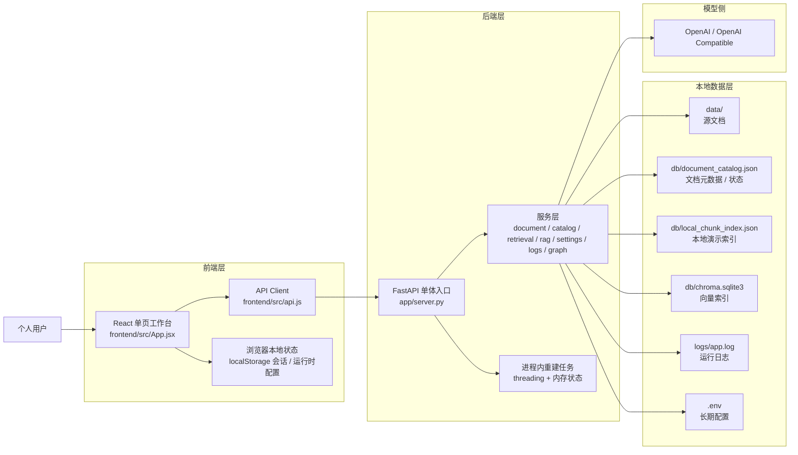
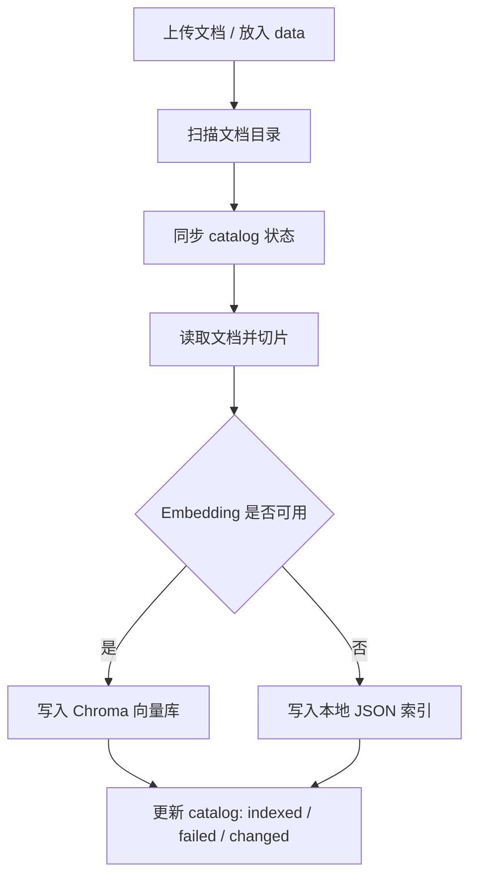
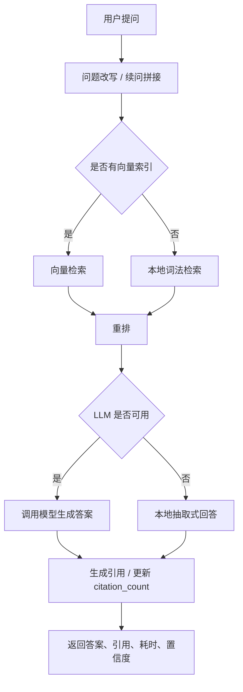
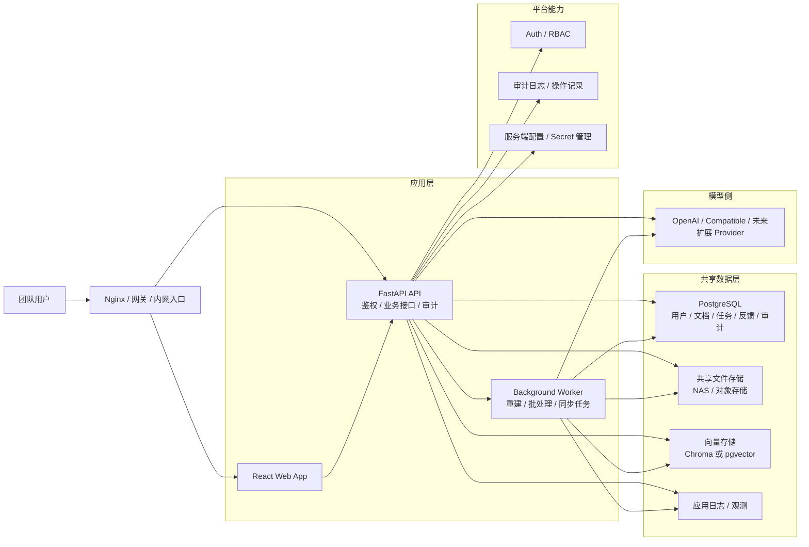

# Aurora Architecture Framework

## 1. 文档目的

这份文档用于明确 Aurora 当前的可运行架构、下一阶段适合团队推广的目标架构，以及后续演进时应保持的模块边界。

适用场景：

- 个人版持续迭代时，避免功能继续堆进单点文件
- 团队版升级前，统一产品、研发、运维的理解
- 后续做前端拆分、权限体系、任务持久化时，作为基线参考

---

## 2. 当前架构图

当前 Aurora 更适合定义为“单机本地知识工作台”，核心特征是：

- React 单页工作台
- FastAPI 单体后端
- 本地文件目录 + 本地索引 + 本地日志
- 运行时支持临时覆写模型配置
- 无鉴权、无角色、无任务持久化



---

## 3. 当前核心链路

### 3.1 文档入库与重建链路



### 3.2 问答链路



---

## 4. 当前模块边界

| 层级 | 作用 | 当前主要文件 |
| --- | --- | --- |
| 前端工作台 | 页面编排、状态管理、交互逻辑 | `frontend/src/App.jsx` |
| 前端请求层 | REST / 流式问答 / 运行时请求头 | `frontend/src/api.js` |
| 后端入口 | 路由、静态资源托管、请求日志 | `app/server.py` |
| 文档服务 | 上传、预览、删除、重命名、解析 | `app/services/document_service.py` |
| 文档目录状态 | content hash、状态流转、标签主题、引用计数 | `app/services/catalog_service.py` |
| 索引服务 | 切片、Embedding、Chroma、本地索引 | `app/services/knowledge_base_service.py` |
| 重建任务 | 重建流程、取消、进度 | `app/services/knowledge_base_job_service.py` |
| 检索与回答 | 检索、重排、RAG、演示模式回答 | `app/services/retrieval_service.py` `app/services/rag_service.py` `app/llm.py` |
| 结构视图 | 轻量知识图谱 | `app/services/knowledge_graph_service.py` |
| 配置与联通性 | `.env` 读写、校验、联通性测试 | `app/services/settings_service.py` `app/services/connectivity_service.py` |
| 运行运维 | 系统概览、日志查询 | `app/services/system_service.py` `app/services/log_service.py` |

---

## 5. 当前架构结论

当前架构适合：

- 个人知识沉淀
- 本地演示和功能验收
- RAG 联调和模型切换验证
- 小规模内部试用

当前架构不适合直接作为团队版落地的原因：

- 文档操作仍然依赖路径语义，边界不够稳
- 任务状态停留在进程内存，重启不可恢复
- 配置和密钥管理偏单机
- 无用户、角色、权限、审计
- 前端主入口过重，不利于多人并行开发

---

## 6. 团队版目标架构图

团队版建议先走“模块化单体 + 后台任务 Worker”路线，不建议一开始拆微服务。



---

## 7. 团队版推荐模块边界

### 7.1 前端推荐拆分

```text
frontend/src/
  app/
  pages/
    overview/
    knowledge/
    chat/
    graph/
    settings/
    logs/
  components/
  hooks/
  api/
  store/
  lib/
  styles/
```

建议边界：

- `pages/` 负责页面级组织，不直接堆业务细节
- `components/` 放面板、表格、弹窗、状态卡片、会话列表等复用组件
- `hooks/` 放数据加载、轮询、流式问答、表单状态
- `api/` 放接口定义和 DTO 映射
- `store/` 放会话、运行时配置、筛选条件等共享状态

### 7.2 后端推荐拆分

```text
app/
  api/
    routes/
      system.py
      documents.py
      knowledge_base.py
      chat.py
      graph.py
      settings.py
      logs.py
  core/
    config.py
    logging.py
    auth.py
  services/
  repositories/
  workers/
  schemas/
```

建议边界：

- `api/routes/` 只处理请求协议与返回格式
- `services/` 负责业务流程编排
- `repositories/` 负责 catalog、任务、用户、反馈等持久化
- `workers/` 负责长任务和异步流程
- `core/` 负责配置、鉴权、日志、基础设施适配

---

## 8. 从个人版到团队版的关键设计原则

1. 文档标识从 `path` 迁移到 `document_id`
2. 密钥只保留在服务端，不进入浏览器长期存储
3. 重建任务必须持久化，允许恢复、取消、失败重试
4. 默认使用共享文件存储，不再假设只有本机 `data/`
5. 先做角色和审计，再做多团队、多空间
6. 保持“模块化单体”，优先解决治理问题，不急着拆微服务

---

## 9. 推荐演进顺序

### P1：先把团队化底座补齐

- 前端拆分 `App.jsx`
- 后端改为 `APIRouter`
- 文档 ID 化，收口绝对路径
- 任务状态入库
- 增加基础角色：`admin / editor / viewer`

### P2：把系统从“可用”拉到“可推广”

- 配置中心改为服务端托管
- 增加操作审计和错误聚合
- 增加 API 集成测试和最小 E2E
- 增加问答反馈闭环和低质量问题池

### P3：做产品化增强

- 多知识空间 / 团队空间
- 图谱与文档、问答、日志的双向跳转
- 更强的知识治理状态
- 更多模型供应商适配

---

## 10. 当前建议的一句话结论

Aurora 现阶段最合适的升级方向，不是继续加功能，而是以这份框架图为基线，把它从“个人本地 AI 工作台”稳步升级为“团队可共享的测试知识工作台”。
