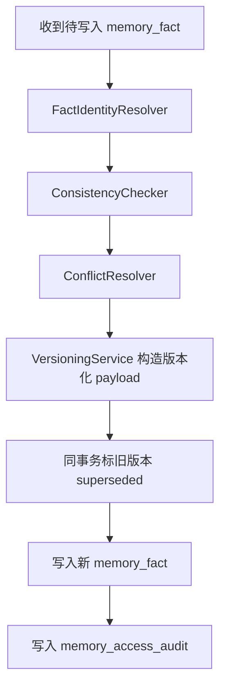
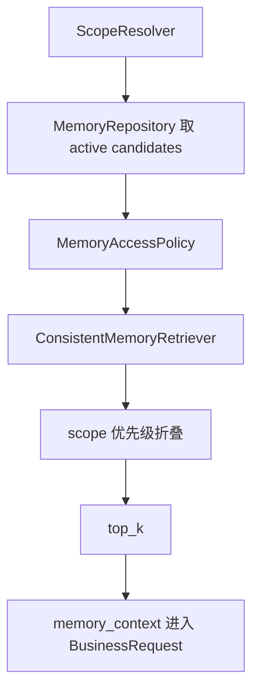

# Aurora Memory Consistency Technical Route

## 1. 文档目标

本文用于说明 Aurora 记忆系统第四特性 `Consistency` 的技术路线、设计原理、实现方法、代码落点与后续演进方向。

第四特性的目标不是让记忆“更聪明”，而是让记忆“更可信”：

- 同一事实被更新后，旧值不再继续干扰默认回答
- 用户纠正过的内容，以新值为准
- 冲突事实不会同时作为当前有效事实进入主链路
- session / user / project / team / global 之间的读取优先级稳定且可解释
- 记忆系统不会随着持续积累退化为多版本脏数据池

---

## 2. 为什么第四特性必须独立建设

Feature 1 解决的是边界问题：

- 谁能读
- 谁能写
- 哪些 scope 可以访问

Feature 2 解决的是 provider 问题：

- 上层业务不依赖某个模型厂商
- memory / knowledge / citations 在 provider 切换时保持稳定

Feature 3 解决的是持久化问题：

- 会话可恢复
- 原始消息可追溯
- memory_facts 可持久化

Feature 4 解决的是可信性问题：

- 哪一条才是“当前有效版本”
- 旧值何时退出默认召回
- 新值如何替代旧值
- 冲突值如何治理而不是一起带入 prompt

如果没有第四特性，前三个特性虽然能让 Aurora 记住更多内容，但并不能保证这些内容在业务上可被稳定信任。

---

## 3. Aurora 业务里“一致性”的定义

### 3.1 insert

新事实写入，且与当前有效事实不冲突。

例如：

- 新增一个项目以前没有出现过的配置项
- 新增一个用户偏好类别

### 3.2 update

同一事实出现了新版本，新值替代旧值。

例如：

- `env.api_base` 从 A 改为 B
- 当前主路线从方案 X 改为方案 Y

### 3.3 correction

用户明确指出旧记忆有误，并给出修正值。

例如：

- “你记错了，我们不是 Flask，是 FastAPI”

`correction` 和普通 `update` 的差异在于：

- correction 明确表达“旧值错误”
- correction 必须保留可追溯链路
- correction 默认优先级高于普通 update

### 3.4 conflict

系统发现两条记忆位于同一业务语义槽位，但无法安全判断该直接替代还是应当并存。

例如：

- 同一项目出现两个互斥技术栈值
- 同一策略位出现两个相反决策

第一阶段的处理原则是保守：

- 不猜
- 不双活
- 标记为 `conflict_pending_review`

### 3.5 coexist

两条记忆虽然相似，但不是同一主版本槽位，可以同时有效。

例如：

- 用户喜欢表格回答
- 用户也喜欢步骤化回答

Aurora 不把所有“相似内容”都当冲突。只有当两条记忆指向同一 `subject_key + fact_key` 且业务上只应存在一个主版本时，才进入版本替代或冲突治理。

---

## 4. 一致性的核心业务规则

### 4.1 唯一有效原则

对于同一组：

- `tenant_id`
- `scope_type`
- `scope_id`
- `subject_key`
- `fact_key`

默认读取时最多只允许一条当前有效主版本进入主链路。

### 4.2 新版本替代旧版本

当新记忆被判定为同一事实的新版本时：

- 旧记忆 `status -> superseded`
- 旧记忆 `superseded_by -> 新记忆 id`
- 新记忆 `supersedes -> 旧记忆 id`
- 新记忆 `version = 旧版本 + 1`

### 4.3 correction 高于普通 update

如果新写入是显式纠错：

- 保留 `correction_of`
- 旧错误值退出默认召回
- 新值成为当前有效主版本

### 4.4 来源优先级

第一阶段采用规则驱动的来源可信度仲裁：

- `user_confirmed > imported > system_generated > model_inferred`

如果旧值来自 `model_inferred`，新值来自 `user_confirmed`，则优先以用户确认值为准。

### 4.5 scope 读取优先级

默认读取优先级为：

1. `session`
2. `user`
3. `project`
4. `team`
5. `global`

这里的含义是：

- `session` 的临时上下文优先影响当前回答
- 但 `session` 不会改写 `project` 的长期事实本身
- `project` 级事实优先于 `team/global` 的通用规则

### 4.6 delete 和 correction 不是一回事

- `deleted`：逻辑删除，不参与默认召回
- `correction`：旧值错误，但保留历史链路用于审计和追溯

---

## 5. 数据模型扩展

在 `memory_facts` 现有字段基础上，第四特性新增以下治理字段：

- `subject_key`
- `fact_key`
- `version`
- `superseded_by`
- `supersedes`
- `correction_of`
- `source_type`
- `source_confidence`
- `reviewed_by_human`
- `consistency_group_id`

字段含义：

- `subject_key`：这条记忆是关于谁或什么
- `fact_key`：这是哪一类事实
- `version`：同一主事实链上的版本号
- `superseded_by`：当前记录被谁替代
- `supersedes`：当前记录替代了谁
- `correction_of`：当前记录纠正了谁
- `source_type`：来源类型
- `source_confidence`：来源置信度
- `reviewed_by_human`：是否经过人工确认
- `consistency_group_id`：一组可能需要一起治理的事实族

当前状态集合为：

- `active`
- `stale`
- `superseded`
- `deleted`
- `conflict_pending_review`

其中 `conflict_pending_review` 的作用是：

- 保证系统在不确定时不做错误替代
- 保留待人工治理的事实
- 默认不进入主 prompt

---

## 6. 一致性模块划分

### 6.1 FactIdentityResolver

代码位置：

- `app/services/fact_identity_resolver.py`

职责：

- 把自由文本写入提升为可治理事实
- 解析或生成 `subject_key`
- 解析或生成 `fact_key`
- 生成 `consistency_group_id`
- 归一化 `source_type` 和 `source_confidence`

第一阶段采用规则驱动，不追求复杂 NLP：

- 优先使用显式传入的 `subject_key / fact_key`
- 支持结构化内容如 `stack.framework: FastAPI`
- 对少量明确的偏好族做并存识别

### 6.2 ConsistencyChecker

代码位置：

- `app/services/consistency_checker.py`

职责：

- 在写入前查询当前有效版本
- 判断当前操作属于：
  - `insert`
  - `update`
  - `correction`
  - `conflict`
  - `coexist`
  - `noop`

判断原则：

- 同一 `subject_key + fact_key` 默认视为同一主事实槽位
- 同一 `consistency_group_id` 下但 `fact_key` 不同，可能是并存，也可能是冲突
- 如果无法安全自动替代，则进入 `conflict_pending_review`

### 6.3 ConflictResolver

代码位置：

- `app/services/conflict_resolver.py`

职责：

- 对 `ConsistencyChecker` 的冲突结果做保守仲裁
- 第一阶段尽量不猜测业务语义
- 能明确并存时转为 `coexist`
- 否则保留 `conflict_pending_review`

### 6.4 VersioningService

代码位置：

- `app/services/versioning_service.py`

职责：

- 分配同一事实链的 `version`
- 维护 `supersedes / superseded_by / correction_of`
- 确保替代链路完整

实现关键点：

- update / correction 在同一事务里先标旧版本 `superseded`
- 再写入新版本
- 配合唯一有效索引，保证默认只有一个当前主版本

### 6.5 ConsistentMemoryRetriever

代码位置：

- `app/services/consistent_memory_retriever.py`

职责：

- 默认过滤非主版本
- 对跨 scope 的同一事实做优先级折叠
- 避免 session/user/project 的同位事实一起污染主回答

---

## 7. 写入链路技术路线

第四特性后的统一写入链路如下：

具体步骤：

1. 收到待写入事实
2. 解析 `subject_key / fact_key / consistency_group_id`
3. 查询当前有效版本
4. 判定操作类型
5. 如需替代，先在事务里标旧版本 `superseded`
6. 写入新版本
7. 写入审计日志

为什么必须先标旧版本再插新版本：

- Aurora 现在对“唯一有效主版本”有数据库级约束
- 如果先插入新版本，再改旧版本，会在事务中间触发唯一索引冲突
- 先标旧值、后插新值，才能同时满足唯一性和原子性

---

## 8. 读取链路技术路线

第四特性后的默认读取链路如下：

读取规则：

- `deleted` 不进入默认召回
- `superseded` 不进入默认召回
- `conflict_pending_review` 不进入默认召回
- 同一 identity 默认只保留一个当前有效主版本
- 跨 scope 同位事实按 `session > user > project > team > global` 折叠

这保证了：

- 旧值不会和新值一起进入主 prompt
- 临时 session 事实可以覆盖当前回答上下文
- 下层长期事实仍然保留在库中供历史审计

---

## 9. 为什么要引入 consistency_group_id

`subject_key + fact_key` 解决的是“同一主事实槽位”的版本治理。

但业务上还存在另一类问题：

- 两条事实不一定是同一个 `fact_key`
- 但它们属于同一事实族，可能并存，也可能冲突

例如：

- `preference.response_style.table`
- `preference.response_style.step_by_step`

它们属于同一个偏好族，但并不互斥，因此需要：

- 用不同 `fact_key` 表示不同可并存值
- 用相同 `consistency_group_id` 表示它们同属一个治理族

而对于互斥事实族：

- checker 可以基于同组事实决定是否进入 `conflict_pending_review`

---

## 10. 数据库约束与迁移方法

代码位置：

- `app/services/storage_service.py`

第四特性做了两件事：

1. 给 `memory_facts` 增加一致性治理字段
2. 增加“唯一有效主版本”索引

唯一有效索引表达的是：

- 同一 `tenant_id + scope_type + scope_id + subject_key + fact_key`
- 当 `status = active`
- 且 `superseded_by` 为空
- 最多只能有一条记录

迁移策略采用轻量本地升级：

- 缺失列时自动补列
- 旧数据自动回填默认 identity
- 如果旧表状态约束不包含 `conflict_pending_review`，则重建表并迁移数据

这保持了 Aurora 一贯的本地 SQLite 升级方式，不引入重型迁移框架。

---

## 11. 内部 API 边界建议

第四特性里，有些能力适合继续放在 internal API 边界之后，而不暴露给普通 chat 主链路。

### 11.1 应继续保持 internal 的能力

- 手工写入 memory_fact
- 显式 `subject_key / fact_key` 写入
- 显式 `correction_of` 纠错
- 历史版本查看
- 审计链路查看

原因：

- 这些能力属于治理工具，不是普通用户对话动作
- 一旦暴露到公开接口，容易引入事实污染和误操作

### 11.2 建议后续新增的 internal API

- conflict 列表查询
- conflict 人工确认
- conflict 驳回
- 人工 promote 某条待审核事实为当前主版本
- 指定 forgetting / archive 操作

### 11.3 不建议直接开放到主 chat API 的能力

- 任意改写 `version`
- 任意改写 `supersedes / superseded_by`
- 任意纠错链编辑
- 任意跨 scope 的治理动作

Aurora 的主 chat API 应继续保持“读取一致性结果”，而不是“直接操纵一致性结构”。

---

## 12. 关键代码落点

当前第四特性的主要代码位置如下：

- `app/schemas.py`
- `app/services/storage_service.py`
- `app/services/memory_repository.py`
- `app/services/fact_identity_resolver.py`
- `app/services/consistency_checker.py`
- `app/services/conflict_resolver.py`
- `app/services/versioning_service.py`
- `app/services/memory_write_service.py`
- `app/services/consistent_memory_retriever.py`
- `app/services/memory_retriever.py`
- `app/api/routes/memory.py`
- `tests/test_services.py`
- `tests/test_api_routes.py`

建议阅读顺序：

1. `app/schemas.py`
2. `app/services/storage_service.py`
3. `app/services/fact_identity_resolver.py`
4. `app/services/consistency_checker.py`
5. `app/services/versioning_service.py`
6. `app/services/memory_write_service.py`
7. `app/services/consistent_memory_retriever.py`
8. `app/api/routes/memory.py`
9. `tests/test_services.py`

---

## 13. 最小验收方法

第四特性至少应验证以下场景：

- 同一 `subject_key + fact_key` 的新版本写入后，旧版本变成 `superseded`
- 旧版本不再进入默认 retrieve
- 显式 correction 后，旧错误值退出默认主链路
- `conflict_pending_review` 不进入默认 retrieve
- session 级同位事实在读取上优先于 project 级事实
- 可并存偏好不会被误判成冲突
- internal history 接口可追溯版本链

---

## 14. 后续演进方向

在当前第四特性底座之上，后续可以自然扩展：

- human review UI
- conflict queue
- correction UI
- forgetting / archive
- source scoring
- summary extraction
- knowledge-memory alignment

演进时建议保持两个约束：

1. 一切 memory 写入继续复用 `MemoryWriteService`
2. 一切默认 retrieve 继续复用 `ConsistentMemoryRetriever`

只要这两个入口不被绕开，Aurora 的记忆系统就能继续扩展而不失控。

---

## 15. 一句话结论

Aurora 第四特性的本质不是“多记一版”，而是“只让当前可信版本进入主链路”。一致性层把记忆从“能存”推进到了“可治理、可追溯、可默认信任”。
