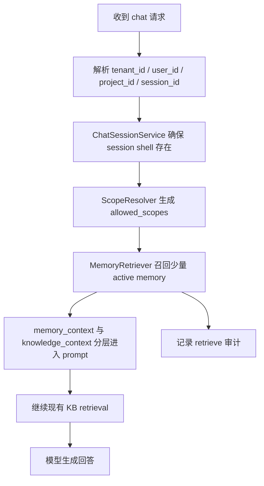

# Aurora Memory Scope & Isolation Technical Route

## 1. 文档目标

本文档用于说明 Aurora 记忆系统第一特性 `Scope & Isolation` 的技术路线、原理方法、代码接入点与后续演进方向。

这份设计的核心目标不是“让记忆变聪明”，而是先把下面三件事做对：

- 这条记忆属于谁
- 这条记忆在哪个业务范围内有效
- 当前请求是否有资格访问或修改它

只有把这层底座做干净，后续的长期记忆、摘要记忆、价值评估、遗忘机制、Provider Independence 才不会建立在脏数据上。

---

## 2. 设计原则

- 默认最小作用域优先
- 能写 `session` 就不直接写 `project/team/global`
- 记忆系统与知识库严格分层
- 作用域解析必须单点收口
- 访问控制必须集中治理
- 存储层只做存储，不承载复杂业务判断
- 第一阶段先保证隔离正确，再考虑智能抽取

---

## 3. 作用域模型

Aurora 第一阶段支持五类 `scope_type`：

| scope_type | 业务含义 | 生命周期 | 典型例子 |
| --- | --- | --- | --- |
| `session` | 只在当前会话中有效的临时上下文 | 短期 | 当前正在讨论 Scope & Isolation |
| `user` | 只对当前用户长期有效的偏好或习惯 | 中长期 | 用户偏好表格输出 |
| `project` | 只对当前项目有效的稳定事实或阶段性决策 | 中长期 | Aurora 当前优先做记忆系统第一特性 |
| `team` | 团队共享规则 | 保守开放 | 测试团队统一使用某种缺陷提交流程 |
| `global` | 平台级规则 | 最保守 | 敏感内容默认不写入长期记忆 |

第一阶段严格落地 `session / user / project`。

`team / global` 暂时采用默认占位机制：

- `team_default`
- `global_default`

这样做的目的是先保留可扩展结构，但不在普通对话场景过早开放共享级写入。

---

## 4. 为什么要把 Memory 和 Knowledge Base 分开

Aurora 当前已经有文档知识库和 RAG 主链路。记忆系统不能简单复用知识库数据，否则会出现两个严重问题：

1. 文档知识是外部资料，不代表用户、项目、会话的真实状态
2. 文档片段如果直接写成 memory，会造成事实污染和重复治理

因此第一阶段明确分层：

- `knowledge_context` 负责文档检索与问答证据
- `memory_facts` 负责会话状态、用户偏好、项目事实、团队规则、全局规则

模型提示词中也把两者拆成两块输入：

- `记忆上下文`
- `知识库片段`

这样后续无论是做 memory ranking、summary memory、conflict resolution，还是替换底层模型，都不会把文档知识和记忆事实搅在一起。

---

## 5. 第一阶段数据模型

### 5.1 chat_sessions

作用：

- 记录一次会话的归属信息
- 作为 session scope 的外壳
- 不存原始消息内容

字段：

- `id`
- `tenant_id`
- `user_id`
- `project_id`
- `title`
- `status`
- `created_at`
- `last_active_at`

### 5.2 memory_facts

作用：

- 记录真正被系统记住的记忆对象
- 不等于原始聊天记录
- 不等于知识库文档片段

字段：

- `id`
- `tenant_id`
- `owner_user_id`
- `project_id`
- `scope_type`
- `scope_id`
- `type`
- `content`
- `status`
- `source_session_id`
- `created_at`
- `updated_at`

约束：

- `scope_type in (session, user, project, team, global)`
- `type in (fact, preference, decision, pending_issue)`
- `status in (active, stale, superseded, deleted)`

### 5.3 memory_access_audit

作用：

- 审计记忆的访问与变更行为
- 为灰度验证和后续风控提供依据

字段：

- `id`
- `tenant_id`
- `request_id`
- `memory_fact_id`
- `action`
- `actor_user_id`
- `session_id`
- `created_at`

动作：

- `create`
- `read`
- `retrieve`
- `update`
- `delete`

---

## 6. 核心模块划分

### 6.1 ScopeResolver

职责：

- 根据一次请求的上下文解析作用域
- 生成本次请求允许访问的 `allowed_scopes`
- 成为唯一的作用域解析入口

输入示例：

- `tenant_id=t1`
- `user_id=u1`
- `project_id=p1`
- `session_id=s1`

输出示例：

```text
[
  ("session", "s1"),
  ("user", "u1"),
  ("project", "p1"),
  ("team", "team_default"),
  ("global", "global_default")
]
```

方法：

- 用 `ScopeRule` 表达作用域解析规则
- 用固定顺序保证最小作用域优先
- 用去重机制避免重复 scope

优点：

- 后续可增加更多 scope 类型
- 不需要把 scope 判断散落到多个 service 里

### 6.2 MemoryAccessPolicy

职责：

- 决定“当前请求能不能读这条记忆”
- 决定“当前请求能不能写这条记忆”

第一阶段规则：

- 不跨 `tenant`
- `session` 默认不跨 session
- `user` 默认不跨 user
- `project` 默认不跨 project
- 普通对话默认不能写 `global`
- `team/global` 写入必须走保守入口
- 文档知识片段禁止直接写入 memory

为什么策略集中化：

- repository 只负责数据访问
- route 只负责入参和响应
- 真正的安全边界必须在 policy 层

### 6.3 MemoryRepository

职责：

- 只负责 `memory_facts` 的数据访问

第一阶段接口：

- `create_memory_fact`
- `get_memory_fact_by_id`
- `list_active_by_scopes`
- `update_memory_fact_status`

### 6.4 MemoryRetriever

职责：

- 根据 `ScopeResolver` 的结果做召回
- 先 scope 过滤，再按时间排序，再取 Top-K

第一阶段策略：

- 只召回 `status=active`
- 按 `updated_at desc`
- 不做 embedding memory 检索
- 不与知识库检索混用

### 6.5 MemoryWriteService

职责：

- 承接手动写入或后续自动抽取的统一写入口
- 在落库前统一校验 scope、source_kind、权限

第一阶段默认写入策略：

- `preference -> user`
- 其他类型默认 `session`
- 如果显式指定更大 scope，仍需通过 policy 复核

---

## 7. Chat 主链路接入方法

第一阶段对现有 RAG 主链路的改造遵循“插层，不重写”的原则。

### 7.1 请求流



### 7.2 接入原则

- memory 在 RAG 之前召回
- knowledge base 的检索逻辑不改
- prompt 中显式拆分 memory 和 KB
- memory 数量严格控制在一个很小的上限

这样可以保证：

- 现有知识库主链路不被破坏
- 记忆只做背景补充，不抢证据层角色

---

## 8. 手动写入内部 API 的技术路线

为了在自动抽取器上线前做灰度验证，第一阶段补充了一个仅内部使用的 memory API。

### 8.1 为什么要有手动写入入口

- 验证作用域和隔离逻辑是否正确
- 验证 audit 是否完整
- 为后续自动抽取器提供对照样本
- 在不放开普通对话自动写入的前提下，先跑通业务链路

### 8.2 API 设计目标

- 不暴露给普通 chat 客户端
- 不绕开 `ScopeResolver` 和 `MemoryAccessPolicy`
- 支持手动创建、读取、列出、更新状态、查看审计

### 8.3 当前内部 API 能力

- `POST /api/v1/internal/memory/facts`
- `GET /api/v1/internal/memory/facts`
- `GET /api/v1/internal/memory/facts/{memory_fact_id}`
- `PATCH /api/v1/internal/memory/facts/{memory_fact_id}/status`
- `GET /api/v1/internal/memory/audit/request/{request_id}`

### 8.4 安全保护方式

必须显式带：

```http
X-Aurora-Internal-Api: true
```

普通内部灰度只允许 `session / user / project`。

如果要写 `team / global`，还需要显式带：

```http
X-Aurora-Actor-Role: admin
X-Aurora-Allow-Shared-Scope-Write: true
X-Aurora-Allow-Global-Write: true
```

并在 body 中设置：

```json
{
  "confirmed": true
}
```

这代表：

- `team/global` 仍是保守入口
- 手动验证也不会默认放开全局污染风险

---

## 9. 原理方法总结

### 9.1 隔离原理

隔离不是靠“约定不要串数据”，而是靠三层联动：

1. 请求上下文标准化
2. 作用域解析单点收口
3. 访问策略集中判断

只要任何一层绕开，隔离就会失效。

### 9.2 排序方法

第一阶段的 memory retrieve 非常保守：

- 只按 scope 过滤
- 只看 `active`
- 只按最近更新时间排序
- 只返回极少量结果

这样做的原因是第一阶段重点是“访问正确”，不是“相关性最优”。

### 9.3 审计方法

所有 memory 行为都进入 audit：

- 创建
- 读取单条
- 列表召回
- 更新状态
- 删除

好处：

- 能验证系统有没有越权召回
- 能追踪一条 memory 是被谁在什么请求中读到的
- 为未来的合规与安全需求做铺垫

---

## 10. 为什么第一阶段不做自动抽取

自动抽取的前提是边界清晰。如果隔离规则和写入边界还没稳定，自动抽取会把错误快速放大：

- 把会话临时状态误写成长期项目事实
- 把用户偏好误写成团队规则
- 把知识库片段误写成记忆
- 把未确认信息误升级成共享规则

因此第一阶段只做：

- 底层数据模型
- 作用域解析
- 访问控制
- 手动写入入口
- 审计闭环

后续自动抽取器必须接在 `MemoryWriteService` 之后，而不是直接写库。

---

## 11. 代码落点

当前实现的主要代码位置如下：

- `app/services/storage_service.py`
- `app/services/memory_scope.py`
- `app/services/memory_access_policy.py`
- `app/services/memory_repository.py`
- `app/services/memory_retriever.py`
- `app/services/memory_write_service.py`
- `app/services/memory_audit_service.py`
- `app/services/chat_session_service.py`
- `app/api/chat.py`
- `app/api/routes/chat.py`
- `app/api/routes/memory.py`
- `app/services/rag_service.py`
- `app/llm.py`

阅读顺序建议：

1. `memory_scope.py`
2. `memory_access_policy.py`
3. `memory_write_service.py`
4. `memory_retriever.py`
5. `api/chat.py`
6. `api/routes/memory.py`

---

## 12. 验收方法

第一阶段至少验证下面这些场景：

- 用户 A 的 user memory 不会被用户 B 召回
- 项目 A 的 project memory 不会被项目 B 召回
- session memory 默认不跨 session
- 普通对话默认不能写 global
- internal memory API 默认不放开 global
- memory retrieve 不影响现有 knowledge retrieval
- 审计记录能追踪 create / read / retrieve / update / delete

---

## 13. 后续演进路线

在当前底座之上，第二阶段可以逐步增加：

- 自动抽取器
- summary memory
- long-term memory
- scoring / forgetting
- conflict resolution
- provider independence

演进时要保持两个约束：

- 新能力必须继续复用 `ScopeResolver`
- 新写入路径必须继续复用 `MemoryWriteService + MemoryAccessPolicy`

只要这两个收口点不被绕开，Aurora 的记忆系统就能持续扩展而不失控。

---

## 14. 一句话结论

Aurora 记忆系统第一特性的本质，不是“记住更多”，而是“先把边界记对”。Scope & Isolation 是后续所有 memory 能力的安全底座，也是 Provider Independence 和长期演进的前提条件。
