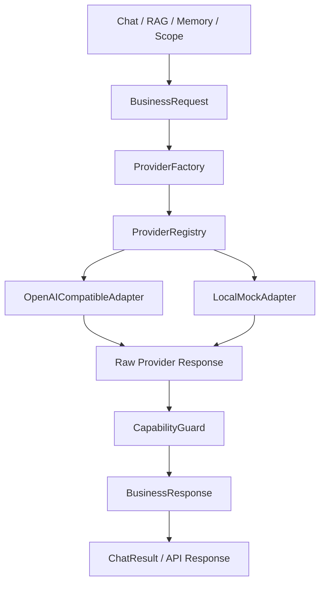
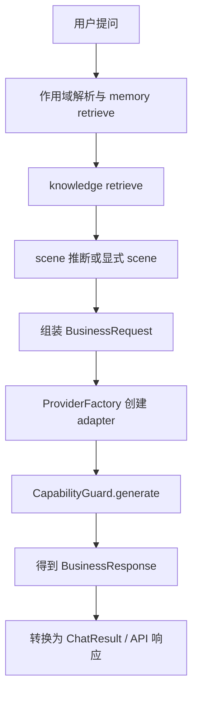

# Aurora Provider Independence Technical Route

## 1. 文档目标

本文用于说明 Aurora 记忆系统第二特性 `Provider Independence` 的技术路线、设计原理、实现方法、代码落点与后续演进方向。

这项能力的目标不是“支持尽可能多的模型厂商”，而是先把 Aurora 面向测试团队的业务能力标准化，再让不同 provider 去适配这套业务契约。

换句话说，Aurora 的核心不是某一家模型接口，而是下面这些稳定业务能力：

- 测试知识问答
- 带引用的回答
- 连续对话
- 结合记忆与知识库的回答
- 稳定的输出结构
- 统一的失败降级行为

只有先把这些能力抽象为 Aurora 自己的契约模型，provider 切换才不会牵动记忆、知识库、作用域和上层业务服务。

---

## 2. 要解决的核心问题

在没有 `Provider Independence` 之前，系统容易出现以下耦合问题：

- 上层业务直接依赖 OpenAI 风格 `messages`
- provider 请求格式和业务语义混在一起
- memory 和 knowledge 虽然在逻辑上分层，但在模型调用边界上仍可能被 provider 协议污染
- provider 返回异常、空响应、低质量输出时，业务层容易直接暴露底层差异
- 新增 provider 时，判断逻辑容易散落到多个 service 中

这些问题的本质不是“适配器写得不够多”，而是“模型边界没有先被业务契约收口”。

---

## 3. 设计原则

- 业务契约优先，provider 协议靠后
- 上层服务只依赖 Aurora 自己的请求和响应模型
- memory_context 与 knowledge_context 必须分层
- citation 的真实性由 Aurora 自己校验，不能相信 provider 原始输出
- provider session、streaming、tool calling 只能作为增强层，不能成为唯一真相源
- provider 选择必须集中化，不能散落在各个 service 中
- 先支持同步生成和稳定降级，再考虑更复杂的高级能力

---

## 4. 总体架构思路

Aurora 当前采用“业务契约 + 适配器 + 守卫层”的三层模型边界：



这里的关键点是：

- `Chat / RAG / Memory / Scope` 只生产 `BusinessRequest`
- provider 只消费 `BusinessRequest`
- provider 只返回 `BusinessResponse`
- 上层最终只依赖 `BusinessResponse` 和 `ChatResult`

Aurora 不让上层业务感知 OpenAI 风格、Anthropic 风格或 Google 风格请求结构。

---

## 5. 业务契约模型

### 5.1 BusinessRequest

`BusinessRequest` 是 Aurora 业务层统一请求对象，当前定义在：

- `app/schemas.py`

它包含以下核心字段：

- `scene`
- `user_query`
- `system_instruction`
- `conversation_context`
- `memory_context`
- `knowledge_context`
- `output_contract`
- `safety_rules`
- `generation_config`
- `request_metadata`

设计含义：

- `scene` 表达业务意图，而不是模型意图
- `conversation_context` 只承载连续对话上下文
- `memory_context` 只承载会话、用户、项目等记忆事实
- `knowledge_context` 只承载知识库证据
- `output_contract` 明确回答结构要求
- `safety_rules` 约束引用、语言、保守回答等行为

### 5.2 BusinessResponse

`BusinessResponse` 是 Aurora 业务层统一响应对象，当前也定义在：

- `app/schemas.py`

核心字段包括：

- `answer`
- `citations`
- `confidence`
- `used_memory_ids`
- `used_knowledge_ids`
- `provider`
- `model`
- `summary`
- `steps`
- `raw_response`
- `error_info`

设计含义：

- 上层 chat query 服务不直接消费 provider 原始响应
- provider 的原始结构只保存在 `raw_response` 中，作为调试辅助
- 业务层只认 `BusinessResponse`

### 5.3 OutputContract

`OutputContract` 用来约束业务输出形态，而不是去约束某个模型的底层协议。

最小可用结构包括：

```json
{
  "must_include_answer": true,
  "must_include_citations": true,
  "preferred_style": "structured",
  "fallback_behavior": "say_insufficient_context",
  "required_sections": ["answer", "citations"],
  "scene_specific_rules": ["Lead with the conclusion first."],
  "refusal_behavior": "acknowledge_limits_without_fabrication"
}
```

`qa_query / troubleshooting / onboarding / command_lookup` 四类场景复用同一套模型，只是 contract 参数不同。

---

## 6. Provider Adapter 层

### 6.1 ProviderAdapter

统一抽象定义在：

- `app/providers/base.py`

核心接口：

```python
generate(request: BusinessRequest) -> BusinessResponse
```

这条接口意味着：

- 输入是 Aurora 自己的业务契约
- 输出也是 Aurora 自己的业务契约
- 业务层永远不需要处理 OpenAI 风格 `messages`

### 6.2 OpenAICompatibleAdapter

当前实现位于：

- `app/providers/openai_compatible_adapter.py`

它不是“OpenAI 专属适配器”，而是“OpenAI-compatible 协议适配器”。

它负责：

- 把 `BusinessRequest` 映射成 OpenAI-compatible `chat.completions.create(...)`
- 要求 provider 尽量输出 JSON 结构
- 解析 provider 的文本响应
- 尽量提取 `answer / summary / steps / citations / confidence`
- 封装成 `BusinessResponse`

这层的职责是协议映射，而不是业务兜底。

### 6.3 LocalMockAdapter

当前实现位于：

- `app/providers/local_mock_adapter.py`

它的作用不是 demo，而是业务编排测试基座：

- 没有真实 provider 时，仍能验证 memory + knowledge + output_contract 链路
- 可以作为配置不完整时的受控降级 provider
- 可以用于集成测试和验收测试

### 6.4 为什么不是“每家厂商一个大 if/else”

如果只用一个路由函数写：

- `if provider == openai`
- `if provider == anthropic`
- `if provider == google`

那么随着 provider 增加，判断会继续膨胀，并逐步泄漏到业务层。

因此 Aurora 采用了：

- `ProviderRegistry`
- `ProviderFactory`

---

## 7. ProviderRegistry + ProviderFactory

### 7.1 ProviderRegistry

当前实现位于：

- `app/providers/registry.py`

职责：

- 维护 `provider_name -> adapter_type` 映射
- 在注册阶段消化 alias
- 保证业务层不需要关心不同厂商别名

例如：

- `openai`
- `openai_compatible`
- `deepseek`
- `qwen`
- `zhipu`
- `moonshot`
- `openrouter`

这些都可以映射到同一个 `OpenAICompatibleAdapter`

### 7.2 ProviderFactory

当前实现位于：

- `app/providers/factory.py`

职责：

- 根据 `AppConfig` 选择实际 adapter
- 在 remote LLM 配置不可用时，回退到 `local_mock`
- 统一创建 adapter 实例

也就是说，业务链路只需要：

```python
adapter = ProviderFactory(config).create()
```

以后新增 provider 时，优先做两件事：

1. 新增 adapter
2. 在 registry 中注册

而不是去修改 chat、memory、rag、scope 等上层服务。

### 7.3 ProviderRouter 的定位

当前代码中仍保留：

- `app/providers/router.py`

但它已经退化为兼容层，内部直接委托 `ProviderFactory`。

这样可以兼顾：

- 新结构往 `registry + factory` 演进
- 旧调用方暂时不必全部重写

---

## 8. Business Capability Guard Layer

这是第二特性的关键层，当前实现位于：

- `app/services/capability_guard.py`

它包含三个核心模块：

- `OutputContractValidator`
- `ResponseNormalizer`
- `CapabilityGuard`

### 8.1 OutputContractValidator

职责：

- 校验 provider 返回的 citation 是否真实存在于 `knowledge_context`
- 只信任 Aurora 自己的 `knowledge_id`
- 删除虚构 citation
- 在必须带引用但 provider 漏掉引用时，按规则补上最靠前的知识证据

原理：

- provider 的 citation 只是“声明”
- `knowledge_context` 才是 Aurora 的证据真相源

### 8.2 ResponseNormalizer

职责：

- 把不同 provider 的输出统一整理为 Aurora 业务格式
- 规范 `summary / steps / answer / citations / confidence`
- 按场景统一回答形态

当前场景规范：

- `qa_query`
  - 结论优先
  - 引用优先
- `troubleshooting`
  - 可能原因
  - 排查步骤
  - 还需上下文
- `onboarding`
  - 步骤说明
  - 相关文档
  - 新人建议
- `command_lookup`
  - 命令建议
  - 参数说明
  - 使用注意
  - 适用场景

### 8.3 CapabilityGuard

职责：

- 包住 provider 生成调用
- 统一处理 provider 异常
- 统一处理空响应或低质量响应
- 把所有异常都转成 Aurora 自己的业务降级输出

这保证了：

- provider 异常不直接冒泡成底层协议差异
- 上层业务得到的是稳定的 Aurora 行为

---

## 9. Chat Query 主链路改造

当前主链路关键代码位于：

- `app/api/chat.py`
- `app/services/rag_service.py`
- `app/api/routes/chat.py`

改造后的主流程如下：



### 9.1 保持不变的部分

- scope / isolation 逻辑不变
- memory retrieve 逻辑不变
- knowledge retrieve 逻辑不变
- RAG 的召回和重排逻辑不变

### 9.2 发生变化的边界

变化只发生在“模型调用边界”：

- 以前：retrieval 之后直接拼 provider 请求
- 现在：retrieval 之后先组装 `BusinessRequest`

这样做的好处是：

- retrieval 不依赖 provider
- memory 不依赖 provider
- knowledge base 不依赖 provider
- 场景化输出规范不依赖 provider

---

## 10. 为什么 memory_context 与 knowledge_context 必须独立

这是第二特性的核心前提之一。

原因有三点：

1. memory 是背景事实，不是引用证据
2. knowledge 是证据来源，必须可校验、可引用
3. provider 可以把两者都拿来“理解问题”，但 Aurora 不能允许它们在业务语义上混层

因此 Aurora 在 `BusinessRequest` 中明确拆分：

- `memory_context`
- `knowledge_context`

并在守卫层中要求：

- citation 只能来自 `knowledge_context`
- memory 不能伪装成知识引用

---

## 11. 降级行为设计

Aurora 不希望把不同 provider 的失败差异暴露给业务层，因此需要统一降级。

当前统一降级包含三类场景：

### 11.1 Retrieval 证据不足

表现：

- 命中为空
- top score 低于阈值

处理方式：

- 直接生成 Aurora 的业务级 fallback
- 不把问题继续交给 provider 瞎猜

### 11.2 Provider 调用异常

表现：

- 网络异常
- provider 报错
- 协议失败

处理方式：

- `CapabilityGuard` 捕获异常
- 生成统一 `BusinessErrorInfo`
- 返回受控 fallback response

### 11.3 Provider 返回低质量输出

表现：

- 空回答
- 极短回答
- 缺少 contract 要求的基本结构

处理方式：

- 统一转入 fallback
- 由 `ResponseNormalizer` 输出稳定格式

---

## 12. 关键代码落点

当前这套能力的主要代码入口如下：

- `app/schemas.py`
- `app/providers/base.py`
- `app/providers/registry.py`
- `app/providers/factory.py`
- `app/providers/openai_compatible_adapter.py`
- `app/providers/local_mock_adapter.py`
- `app/services/capability_guard.py`
- `app/services/rag_service.py`
- `app/api/chat.py`
- `app/api/routes/chat.py`
- `app/services/connectivity_service.py`
- `tests/test_provider_independence.py`

建议阅读顺序：

1. `app/schemas.py`
2. `app/providers/base.py`
3. `app/providers/registry.py`
4. `app/providers/factory.py`
5. `app/providers/openai_compatible_adapter.py`
6. `app/services/capability_guard.py`
7. `app/services/rag_service.py`
8. `tests/test_provider_independence.py`

---

## 13. 为什么这条路线适合 Aurora

Aurora 不是“模型 SDK 演示项目”，而是测试团队的本地知识工作台。

因此它最需要的是：

- 业务行为稳定
- 引用逻辑可控
- 记忆和知识分层清晰
- provider 可替换
- 失败有统一兜底

`Provider Independence` 这条路线本质上是在把 Aurora 的核心资产从“某个 provider 的请求格式”转移到“自己的业务契约和业务守卫”上。

这比单纯封装一个 `client.chat.completions.create(...)` 更重要。

---

## 14. 后续演进路线

在当前结构之上，下一步可以自然扩展：

- `AnthropicAdapter`
- `GoogleAdapter`
- `LocalModelAdapter`
- `ProviderCapabilities`
- provider-native streaming
- provider session optimization
- tool calling

演进时建议保持两个约束：

1. 新 provider 必须继续实现 `BusinessRequest -> BusinessResponse`
2. 新能力必须继续通过 `CapabilityGuard` 输出稳定业务行为

只要这两个约束不被绕开，Aurora 就可以持续扩展 provider，而不破坏 memory、knowledge、scope 和上层业务能力。

---

## 15. 一句话结论

Aurora 的 `Provider Independence` 本质不是“把 OpenAI 换成别家模型”，而是“先把 Aurora 自己的业务能力标准化，再让任意 provider 去适配这套能力”。

---

## 16. Internal Provider API Boundary

为避免第二特性的验证链路和第三特性的会话持久化混线，内部 provider API 额外遵循一条边界约束：

- `GET /api/v1/internal/providers` 只做 registry / alias / adapter 观测
- `POST /api/v1/internal/providers/resolve` 只做 provider 解析与 fallback 说明
- `POST /api/v1/internal/providers/dry-run` 只做 scope + memory + retrieval + provider + capability guard 的只读验证

特别说明：

- `dry-run` 不写入 `chat_sessions`
- `dry-run` 不写入 `chat_messages`
- `dry-run` 不依赖 session recovery
- 这样可以单独验收第二特性的 provider boundary，而不被第三特性的持久化行为干扰
