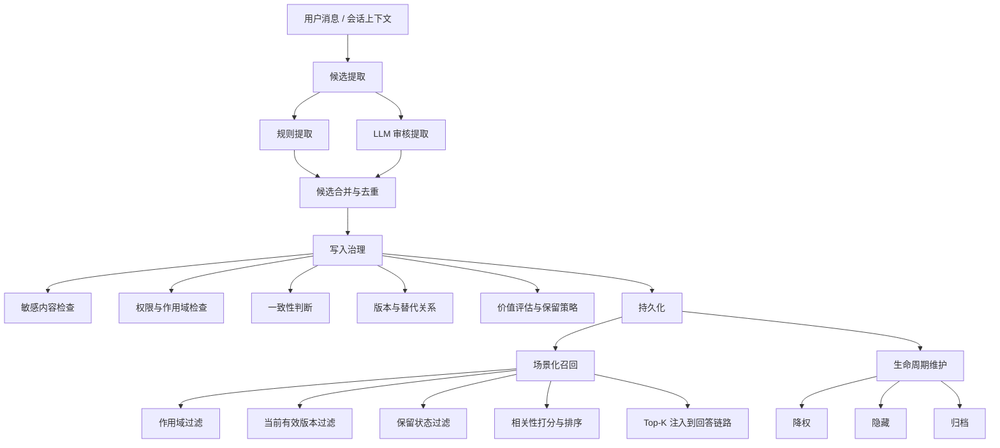

# Aurora Docs README

## 推荐入口

如果你现在关注的是 Aurora 的共享部署、安全收口或试点上线，请优先看这几份文档：

- [PHASE0_SHARED_DEPLOYMENT_BASELINE.md](./PHASE0_SHARED_DEPLOYMENT_BASELINE.md)：阶段 0 定版基线、阶段路线和团队试点验收门槛
- [PYTHON_BACKEND_RECLASSIFICATION_AND_PROTECTION.md](./PYTHON_BACKEND_RECLASSIFICATION_AND_PROTECTION.md)：Python 后端重分类方案与核心代码保护建议
- [ARCHITECTURE_FRAMEWORK.md](./ARCHITECTURE_FRAMEWORK.md)：产品与系统架构框架
- [SECURITY_PENDING.md](./SECURITY_PENDING.md)：仍待落地的安全待办
- [UNFINISHED_BACKLOG.md](./UNFINISHED_BACKLOG.md)：P0 之后的持续交付待办

这份 README 的目标只有一个：把 Aurora 记忆系统讲明白，让你以后回来看时，不需要先翻十几份技术路线文档。

如果把记忆系统说得足够简单，它其实就在解决四个问题：

1. 什么内容值得记住
2. 这些内容该记到哪个作用域
3. 什么时候应该把它拿出来辅助回答
4. 什么时候应该降权、隐藏或归档

---

## 先建立一个直觉

Aurora 的“记忆”不是聊天记录的简单拼接，也不是把所有用户说过的话都塞进 prompt。

它更像一个受治理的事实层：

- 输入是对话、配置、业务上下文
- 中间会经过提取、清洗、权限、冲突判断、版本治理、价值评估
- 输出是“当前仍然可信、仍然有价值、而且在当前场景下值得被注入”的少量记忆

所以这套系统的关键词不是“存得多”，而是：

- 存得准
- 拿得稳
- 用得少但有用
- 旧内容不会一直污染主链路

---

## 一句话理解核心对象

你可以把一条记忆理解成一条“被治理过的事实”。

它通常至少包含这些维度：

- `content`：具体内容，比如“response style: concise”
- `type`：记忆类型，比如 `fact`、`preference`、`decision`、`pending_issue`
- `scope`：作用域，比如 `session`、`user`、`project`、`team`、`global`
- `subject_key` / `fact_key`：这条内容在“说谁的什么”
- `version`：这是同一事实链的第几个版本
- `status`：当前是有效、冲突中、已过时、已被替代，还是已归档
- `retrieval_visibility`：默认检索时是正常可见、降权、隐藏，还是仅归档可见

这意味着 Aurora 记住的不是一句自然语言本身，而是“可管理的业务事实”。

---

## 系统总流程



---

## 写入链路在做什么

### 1. 候选提取

Aurora 当前是“双层提取”：

- 第一层是规则提取
- 第二层是 LLM 审核提取

规则提取负责抓高确定性的内容，例如：

- 明确的“记住……”
- 明确的结构化键值，比如 `stack.framework: FastAPI`
- 明确的表达偏好，比如“以后回答简洁一点”“用表格”“分步骤”

LLM 审核提取负责补规则抓不到、但仍然比较稳定的事实。它不是自由发挥，而是受约束地做“补充候选”：

- 只补充 durable 的内容
- 只返回高置信候选
- 不重复规则层已经提取过的内容
- 不允许把密钥、长日志、堆栈、路径、敏感信息写进去

这一层在代码里主要对应：

- [chat_memory_service.py](/C:/Users/ddd/Desktop/Aurora/app/services/memory/write/chat_memory_service.py)
- [chat_memory_llm_review_service.py](/C:/Users/ddd/Desktop/Aurora/app/services/memory/write/chat_memory_llm_review_service.py)

### 2. 写入治理

候选不是提出来就直接落库，还要经过一层很重的治理。

可以把它理解成一条受控写入管道：

1. 先做敏感内容检查
2. 再做权限和作用域检查
3. 再做 prompt injection / trust 风险检查
4. 再判断这条内容和现有记忆是什么关系
5. 最后才允许写入

这一层的核心入口是：

- [memory_write_service.py](/C:/Users/ddd/Desktop/Aurora/app/services/memory/write/memory_write_service.py)

### 3. 一致性判断

一致性判断解决的是：同一件事情，系统现在已经记过了，那新来的这一条到底算什么？

Aurora 不是简单覆盖，而是先分类：

- `insert`：以前没有，新增
- `update`：以前有，但新内容更可信，可以替换当前版本
- `correction`：明确是在纠正过去的错误内容
- `coexist`：这是允许并存的一类事实
- `conflict`：系统没把握，先挂成冲突待审
- `noop`：内容相同且没有更高可信度，不必重复写

判断逻辑的直觉是：

- 先找当前生效版本
- 再看 incoming 和 current 是否内容一致
- 如果一致，只在“可信度更高”时刷新
- 如果不一致，只在证据足够强时替换
- 否则宁可进入冲突，也不盲目覆盖

这一层主要对应：

- [consistency_checker.py](/C:/Users/ddd/Desktop/Aurora/app/services/memory/write/consistency_checker.py)

### 4. 版本治理

Aurora 不是覆盖式存储，而是版本式存储。

也就是说，新值上来时：

- 新值会获得更高的 `version`
- 老的当前值会被标记为 `superseded`
- 两者之间会记录 `supersedes / superseded_by`

这样做的好处是：

- 默认问答只看当前有效值
- 历史值不会丢
- 审计、回溯、纠错都有依据

这一层主要对应：

- [versioning_service.py](/C:/Users/ddd/Desktop/Aurora/app/services/memory/write/versioning_service.py)

### 5. 价值评估与保留策略

不是所有记忆都应该永久保留在默认链路里。

Aurora 会根据：

- 作用域
- 类型
- 来源可信度
- 是否用户确认
- 是否长期有价值
- 是否已经冷却或过期

给每条记忆一个 retention 方向。

最直观的规律是：

- `session` 级内容通常短命
- `user preference` 比较耐用
- `project/team decision` 更值得长期保留
- 已关闭的 `pending_issue` 会更快退出主链路

这一层主要对应：

- [retention_policy.py](/C:/Users/ddd/Desktop/Aurora/app/services/retention_policy.py)
- [memory_value_evaluator.py](/C:/Users/ddd/Desktop/Aurora/app/services/memory/governance/memory_value_evaluator.py)

---

## 召回链路在做什么

写进去不代表每次都拿出来。

Aurora 的召回链路更像“先做很多过滤，再做少量注入”。

### 1. 先决定这次需不需要记忆

系统会先判断当前场景，比如：

- `qa_query`
- `troubleshooting`
- `onboarding`
- `command_lookup`

然后根据场景构建检索计划：

- 最多要拿多少条
- 每个 scope 最多给几条
- 最低相关度是多少
- 哪些类型在这个场景里是启用的

如果只是普通泛问，而且用户问题里没有明显上下文信号，系统会把记忆当成一个小增强，而不是强行塞很多内容。

对应代码：

- [memory_retrieval_planner.py](/C:/Users/ddd/Desktop/Aurora/app/services/memory/read/memory_retrieval_planner.py)

### 2. 按作用域选候选

系统只会从当前请求允许访问的 scope 中取候选，比如：

- 当前 session
- 当前 user
- 当前 project
- 团队级
- 全局级

但不是所有作用域都一定有同样权重，具体要看场景策略。

### 3. 只保留当前有效事实

即便库里有多条历史记录，默认召回不会全给。

Aurora 会先把这些候选折叠成“当前有效版本”：

- 已被 supersede 的旧版本不会进入默认链路
- 冲突中的内容不会直接混进回答
- 低可见度或已归档的内容会进一步被过滤

这一步是 Aurora 记忆链路最重要的“去噪器”之一。

### 4. 做相关性和综合排序

Aurora 最终不是单看一个分数，而是组合多个轻量信号：

- relevance：和当前问题有多相关
- scope_priority：当前场景下这个 scope 有多重要
- recency：是否最近还在活跃
- type_priority：这个类型在当前场景里是否重要
- source_confidence：来源可信度
- retention_value：长期价值和保留价值

对应代码：

- [memory_ranker.py](/C:/Users/ddd/Desktop/Aurora/app/services/memory/read/memory_ranker.py)

当前默认权重可以理解为：

- 相关性最重要
- retention value 也很重要
- scope/type/recency 再做辅助平衡

### 5. 最后只注入少量 Top-K

排完序也不会全部注入。

系统还会继续做最后一轮约束：

- 总 Top-K 限制
- 每个 scope 的上限
- 最低注入阈值
- 某些场景下的 fallback 逻辑

最终进入 prompt 的，应该是“少量、相关、当前有效、值得出现”的记忆，而不是历史堆积。

这一层主入口是：

- [memory_retriever.py](/C:/Users/ddd/Desktop/Aurora/app/services/memory/read/memory_retriever.py)

---

## 遗忘不是删除，而是退出主链路

Aurora 的 forgetting 设计不是“时间到了就删库”，而是更偏生命周期管理。

一条记忆可能经历这些状态：

- `normal`：正常参与默认检索
- `deprioritized`：还能被看到，但排序会吃惩罚
- `hidden_from_default`：默认链路不再参与，但还能审计或内部读取
- `archive_only`：只保留作归档和历史追踪

这个设计的关键点是：

- 旧内容不会一直污染回答
- 但历史链条不会丢
- 后续仍然可以做审计、回放、纠错

如果你要抓 forgetting 的主逻辑，优先看：

- [forgetting_planner.py](/C:/Users/ddd/Desktop/Aurora/app/services/forgetting_planner.py)
- [forgetting_executor.py](/C:/Users/ddd/Desktop/Aurora/app/services/forgetting_executor.py)

---

## 一段伪代码看懂整个算法

```text
on_chat_turn(user_message, assistant_result, context):
    rule_candidates = extract_by_rules(user_message)
    llm_candidates = llm_review(user_message, assistant_result, rule_candidates)
    candidates = merge_and_deduplicate(rule_candidates, llm_candidates)

    for candidate in candidates:
        payload = normalize(candidate, context)
        guard(payload)
        identity = resolve_identity(payload)
        decision = consistency_check(payload, identity)
        versioned_payload = build_versioned_payload(payload, identity, decision)
        value_snapshot = evaluate_value(versioned_payload)
        persist(versioned_payload, value_snapshot)

on_retrieve(user_query, scene, context):
    plan = build_scene_plan(scene, user_query, context.allowed_scopes)
    candidates = load_candidates_by_scope(plan)
    candidates = keep_current_effective(candidates)
    candidates = apply_retention_visibility(candidates)
    ranked = score_and_rank(candidates, plan, user_query)
    selected = select_top_k_with_scope_caps(ranked, plan)
    return build_prompt_injection(selected)
```

如果你只记住这段，其实已经抓住了这套系统 80% 的骨架。

---

## 这些长文档分别该什么时候看

### 只想先看懂全局

先看这三份：

1. [README.md](/C:/Users/ddd/Desktop/Aurora/docs/README.md)
2. [ARCHITECTURE_FRAMEWORK.md](/C:/Users/ddd/Desktop/Aurora/docs/ARCHITECTURE_FRAMEWORK.md)
3. [MEMORY_RETRIEVABILITY_TECHNICAL_ROUTE.md](/C:/Users/ddd/Desktop/Aurora/docs/MEMORY_RETRIEVABILITY_TECHNICAL_ROUTE.md)

### 只关心“怎么写进去”

优先看：

1. [MEMORY_SCOPE_ISOLATION_TECHNICAL_ROUTE.md](/C:/Users/ddd/Desktop/Aurora/docs/MEMORY_SCOPE_ISOLATION_TECHNICAL_ROUTE.md)
2. [MEMORY_PERSISTENCE_EXTENSIBILITY_TECHNICAL_ROUTE.md](/C:/Users/ddd/Desktop/Aurora/docs/MEMORY_PERSISTENCE_EXTENSIBILITY_TECHNICAL_ROUTE.md)
3. [MEMORY_CONSISTENCY_TECHNICAL_ROUTE.md](/C:/Users/ddd/Desktop/Aurora/docs/MEMORY_CONSISTENCY_TECHNICAL_ROUTE.md)

### 只关心“怎么召回和排序”

优先看：

1. [MEMORY_RETRIEVABILITY_TECHNICAL_ROUTE.md](/C:/Users/ddd/Desktop/Aurora/docs/MEMORY_RETRIEVABILITY_TECHNICAL_ROUTE.md)
2. [MEMORY_RETRIEVABILITY_IMPLEMENTATION_GUIDE.md](/C:/Users/ddd/Desktop/Aurora/docs/MEMORY_RETRIEVABILITY_IMPLEMENTATION_GUIDE.md)
3. [MEMORY_VALUE_EVALUATION_FORGETTING_TECHNICAL_ROUTE.md](/C:/Users/ddd/Desktop/Aurora/docs/MEMORY_VALUE_EVALUATION_FORGETTING_TECHNICAL_ROUTE.md)

### 只关心“安全、审计和治理”

优先看：

1. [MEMORY_OPERABILITY_SECURITY_GOVERNANCE_TECHNICAL_ROUTE.md](/C:/Users/ddd/Desktop/Aurora/docs/MEMORY_OPERABILITY_SECURITY_GOVERNANCE_TECHNICAL_ROUTE.md)
2. [PROVIDER_INDEPENDENCE_TECHNICAL_ROUTE.md](/C:/Users/ddd/Desktop/Aurora/docs/PROVIDER_INDEPENDENCE_TECHNICAL_ROUTE.md)

---

## 后端是不是都堆在 server 里

结论先说：

- 不是
- `server.py` 现在更像组合入口，不是主要业务承载点
- 真正有继续分层空间的地方，在 `services` 的“横向太平”和少数超大类，不在 `server.py`

### 当前实际分层

现在后端大体是这样：

- `app/server.py`
  - FastAPI 应用创建
  - middleware 挂载
  - router 注册
  - 前端静态资源入口
- `app/api/routes/`
  - HTTP 路由边界
  - 请求到用例的入口
- `app/api/*.py`
  - 一些编排、序列化、请求模型和路由辅助
- `app/services/`
  - 主要业务逻辑
  - 记忆写入、检索、治理、知识库任务、日志、设置等
- `app/providers/`
  - Provider 抽象和适配层

所以从职责上讲，`server.py` 并不厚。真正厚的是一些 service 和 repository 风格文件。

### 当前最值得继续拆的点

从行数看，当前更像“服务层扁平化过度”，不是“server 过厚”：

- [memory_write_service.py](/C:/Users/ddd/Desktop/Aurora/app/services/memory/write/memory_write_service.py) 约 764 行
- [storage_service.py](/C:/Users/ddd/Desktop/Aurora/app/services/storage_service.py) 约 676 行
- [catalog_service.py](/C:/Users/ddd/Desktop/Aurora/app/services/catalog_service.py) 约 673 行
- [memory_repository.py](/C:/Users/ddd/Desktop/Aurora/app/services/memory/governance/memory_repository.py) 约 630 行
- [knowledge_base_job_service.py](/C:/Users/ddd/Desktop/Aurora/app/services/knowledge_base_job_service.py) 约 491 行
- [retrieval_service.py](/C:/Users/ddd/Desktop/Aurora/app/services/retrieval_service.py) 约 463 行
- [memory_retriever.py](/C:/Users/ddd/Desktop/Aurora/app/services/memory/read/memory_retriever.py) 约 462 行
- [rag_service.py](/C:/Users/ddd/Desktop/Aurora/app/services/rag_service.py) 约 405 行

### 我建议的下一步分层方向

如果要继续把后端分层做得更舒服，我建议这样拆，而不是去动 `server.py`：

1. 把 `app/services/` 按领域改成子目录

建议至少拆成：

- `app/services/memory/write/`
- `app/services/memory/read/`
- `app/services/memory/governance/`
- `app/services/memory/lifecycle/`
- `app/services/chat/`
- `app/services/knowledge/`
- `app/services/system/`

2. 把 repository / storage 从 service 层里抽出来

比如：

- `app/repositories/memory_repository.py`
- `app/repositories/session_repository.py`
- `app/infra/storage/state_db.py`

这样 service 更像“用例协调者”，repository 更像“数据访问边界”。

3. 把大类拆成 orchestrator + smaller policies

比如 `memory_write_service.py` 现在其实承担了：

- payload 构建
- 安全治理
- 一致性判断
- 版本治理
- 价值评估
- 落库编排

它可以继续拆成：

- `memory_write_orchestrator`
- `memory_write_guards`
- `memory_write_persistence`
- `memory_write_metrics`

4. 保持 `server.py` 继续当 composition root

这个文件现在做的事情是合理的，不建议为了“看起来更分层”而硬拆。

### 现在要不要立刻重构

我的判断是：

- 值得继续分层
- 但优先级不在 `server.py`
- 最应该先拆的是记忆域和知识库任务域的大文件

换句话说，当前的问题更像“业务服务过于平铺”，而不是“入口文件过厚”。

---

## 你后面回看时，建议怎么用这份 README

如果你以后回来想快速恢复上下文，可以按这个顺序：

1. 先看这份 [README.md](/C:/Users/ddd/Desktop/Aurora/docs/README.md)
2. 再看写入链路和召回链路两段
3. 确认你这次想看的重点是“写入 / 检索 / 遗忘 / 治理”
4. 最后再跳去对应的长文档深挖

这样比从一堆 `*_TECHNICAL_ROUTE.md` 直接开看，成本会低很多。
