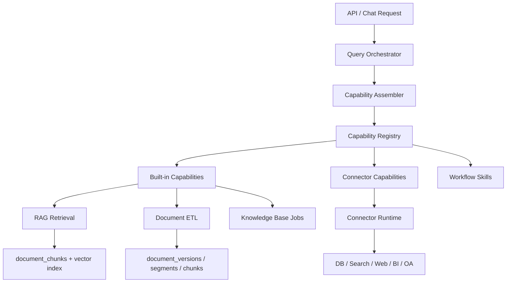

# Aurora Connector / Capability Registry 架构设计

## 1. 设计目标

这份文档用于把前面对 ClaudeCode `src` 的分析，翻译成一版适合 Aurora 当前代码库的目标架构。

这里不是空中楼阁式重写，而是基于 Aurora 现有能力演进：

- 已有统一 ETL 输出：`app/services/etl`
- 已有结构化落库：`document_versions / document_segments / document_chunks`
- 已有检索层：`app/services/retrieval_service.py`
- 已有 RAG 主链路：`app/services/rag_service.py`
- 已有后台重建任务：`app/services/knowledge_base_job_service.py`

目标不是把 Aurora 变复杂，而是解决下面几个即将出现的问题：

- 能力越来越多后如何统一注册和暴露
- 外部数据源和外部工具如何以一致方式接入
- 多租户和权限隔离如何前置到能力装配阶段
- 工具太多时如何减少模型路由噪声
- 如何让现有知识库问答链路平滑升级，而不是推倒重来

## 2. 核心原则

### 2.1 Connector 和 Capability 分层

- Connector 是外部系统接入层。
- Capability 是 Aurora 内部统一能力对象。
- Connector 负责翻译外部协议。
- Capability 负责被 Router、策略层、审计层和 UI 共同消费。

### 2.2 Plugin 是分发单元，Capability 是运行时单元

- Plugin / Connector Package 用于声明和分发能力。
- Tool / Command / Resource / Workflow 是运行时对象。

### 2.3 JSON 是统一协议，不是高频查询格式

- ETL 和 Connector 可以统一输出 JSON payload。
- 在线热路径要依赖结构化表，不依赖每次扫 JSON。
- 常查字段必须物化为结构化列。

### 2.4 权限在装配前生效

- 不是让模型先看到所有能力，再在调用时拒绝。
- 而是在能力装配时，就根据租户、用户、部门、场景完成过滤。

### 2.5 先内建能力注册，再开放外部连接器

Aurora 当前最稳的路线不是一开始就做复杂插件市场，而是：

1. 先把内建知识库能力注册进 Registry。
2. 再引入 Manifest Loader。
3. 再开放外部 Connector。
4. 最后再开放 Plugin Package 和 Workflow Skill。

## 3. 建议的整体分层



## 4. 推荐的 Python 包结构

下面的结构以 Aurora 当前 `app/services` 风格为基础，不强行引入过多新层级。

```text
app/
  api/
    routes/
  providers/
  schemas.py
  services/
    capabilities/
      __init__.py
      assembler.py
      registry.py
      resolver.py
      policy.py
      search.py
      execution.py
      audit.py
      models.py
      base.py
      builtin/
        __init__.py
        rag_query_tool.py
        kb_rebuild_command.py
        document_preview_resource.py
        document_import_workflow.py
      workflows/
        __init__.py
        loader.py
        renderer.py
        registry.py
    connectors/
      __init__.py
      registry.py
      manifest_loader.py
      runtime.py
      auth.py
      cache.py
      policies.py
      builtin/
        __init__.py
        local_kb_connector.py
        postgres_connector.py
        web_search_connector.py
      manifests/
        __init__.py
    etl/
      ...
    document_service.py
    document_materialization_service.py
    retrieval_service.py
    rag_service.py
    knowledge_base_job_service.py
    storage_service.py
```

### 4.1 每个子包职责

`app/services/capabilities`

- 统一定义 Tool / Command / Resource / Workflow 接口
- 提供 Registry、Assembler、Search、Execution
- 负责“哪些能力对当前请求可见”

`app/services/connectors`

- 负责连接外部系统
- 负责 Manifest 解析、鉴权、缓存、签名判重
- 把外部能力翻译成 Aurora 内部 Capability

`app/services/capabilities/builtin`

- 把 Aurora 当前已有能力包装为内建 Capability
- 这是第一阶段最重要的落地点

`app/services/capabilities/workflows`

- 负责类似 Skill 的工作流能力
- 用于承载 prompt、工具白名单、模型选择、路由条件

## 5. 推荐的数据库存储结构

Aurora 当前已经有以下结构化表：

- `documents`
- `document_versions`
- `document_segments`
- `document_chunks`

这几张表非常适合作为“文档类内建连接器”的底座，不需要推翻。

在此基础上，建议新增能力注册和连接器管理表。

## 5.1 Connector / Package 相关表

### `connector_packages`

用于定义一个插件包或连接器包的分发实体。

建议字段：

- `package_id`
- `package_name`
- `package_type`
- `source_type`
- `source_uri`
- `version`
- `display_name`
- `description`
- `manifest_json`
- `status`
- `created_at`
- `updated_at`

说明：

- `package_type` 可以区分 `builtin / connector / workflow / plugin`
- `manifest_json` 保留原始声明，便于审计和重建

### `connector_instances`

用于描述某个连接器在某个租户/项目/空间中的启用实例。

建议字段：

- `instance_id`
- `package_id`
- `tenant_id`
- `project_id`
- `scope_type`
- `scope_id`
- `display_name`
- `enabled`
- `priority`
- `config_json`
- `credential_ref`
- `signature_hash`
- `last_sync_at`
- `created_at`
- `updated_at`

说明：

- `signature_hash` 用于真实连接签名判重
- `credential_ref` 指向密钥管理系统，而不是直接存明文

### `connector_instance_status`

用于记录连接健康度和最近错误，便于 UI 和运维使用。

建议字段：

- `instance_id`
- `health_status`
- `last_error`
- `last_checked_at`
- `last_success_at`

## 5.2 Capability 相关表

### `capability_definitions`

用于注册系统里可被装配的能力定义。

建议字段：

- `capability_id`
- `package_id`
- `capability_type`
- `capability_name`
- `display_name`
- `description`
- `provider_kind`
- `read_only`
- `concurrency_safe`
- `defer_load`
- `visibility`
- `input_schema_json`
- `output_schema_json`
- `metadata_json`
- `created_at`
- `updated_at`

说明：

- `capability_type` 推荐枚举：`tool / command / resource / workflow`
- `provider_kind` 用于标识 `builtin / connector / manifest / workflow`

### `capability_bindings`

把能力定义绑定到某个连接器实例、租户或项目空间。

建议字段：

- `binding_id`
- `capability_id`
- `instance_id`
- `tenant_id`
- `project_id`
- `scope_type`
- `scope_id`
- `enabled`
- `priority`
- `routing_tags_json`
- `activation_rules_json`
- `created_at`
- `updated_at`

说明：

- `activation_rules_json` 用于表达条件激活规则
- 例如仅在 `excel`、`policy`、`finance` 等场景启用

### `capability_permissions`

用于前置可见性过滤，而不是运行时临时拒绝。

建议字段：

- `permission_id`
- `binding_id`
- `tenant_id`
- `department_id`
- `role_code`
- `user_id`
- `allow_in_router`
- `allow_user_invoke`
- `allow_model_invoke`
- `allow_background_job`
- `policy_json`
- `created_at`
- `updated_at`

## 5.3 Execution / Audit 表

### `tool_execution_audit`

记录 Tool 的调用轨迹。

建议字段：

- `execution_id`
- `request_id`
- `session_id`
- `capability_id`
- `binding_id`
- `tool_name`
- `invoker_type`
- `status`
- `duration_ms`
- `input_redacted_json`
- `output_redacted_json`
- `error_code`
- `error_message`
- `created_at`

### `command_execution_audit`

记录 Command / Workflow 的调用轨迹。

### `resource_access_audit`

记录 Resource 的读取轨迹。

### `capability_cache_entries`

可选表，用于缓存 Connector 发现出的远端资源列表、schema、目录摘要等。

## 5.4 与现有文档结构的关系

Aurora 当前的文档表建议保持如下职责：

- `documents`
  - 文档主记录和状态
- `document_versions`
  - 某份文档的 ETL 版本快照
- `document_segments`
  - 页、sheet、HTML 主体段等规范化 segment
- `document_chunks`
  - 检索热路径 chunk

换句话说：

- 文档存储层继续承担“文档型连接器的数据平面”
- Connector / Capability 新表承担“能力注册和装配控制平面”

## 6. Tool / Command / Resource / Workflow 抽象接口

下面不是最终实现代码，而是 Aurora 推荐的抽象接口方向。

```python
from __future__ import annotations

from dataclasses import dataclass, field
from typing import Any, Protocol


@dataclass(slots=True)
class CapabilityContext:
    """当前能力调用的统一上下文。"""

    request_id: str
    tenant_id: str
    user_id: str
    project_id: str
    department_id: str = ""
    session_id: str = ""
    scene: str = ""
    tags: list[str] = field(default_factory=list)
    metadata: dict[str, Any] = field(default_factory=dict)


@dataclass(slots=True)
class CapabilityDescriptor:
    """注册中心中的能力定义。"""

    capability_id: str
    capability_type: str
    name: str
    display_name: str
    description: str
    read_only: bool = True
    concurrency_safe: bool = True
    defer_load: bool = False
    allow_user_invoke: bool = True
    allow_model_invoke: bool = True
    metadata: dict[str, Any] = field(default_factory=dict)


class Tool(Protocol):
    """可执行动作。"""

    descriptor: CapabilityDescriptor

    async def execute(
        self,
        payload: dict[str, Any],
        context: CapabilityContext,
    ) -> dict[str, Any]:
        ...


class Command(Protocol):
    """用户或模型可见的能力入口。"""

    descriptor: CapabilityDescriptor

    async def build_invocation(
        self,
        arguments: dict[str, Any],
        context: CapabilityContext,
    ) -> dict[str, Any]:
        ...


class Resource(Protocol):
    """只读上下文资源。"""

    descriptor: CapabilityDescriptor

    async def read(
        self,
        selector: dict[str, Any],
        context: CapabilityContext,
    ) -> dict[str, Any]:
        ...


class Workflow(Protocol):
    """由多能力组合出的工作流。"""

    descriptor: CapabilityDescriptor

    async def run(
        self,
        arguments: dict[str, Any],
        context: CapabilityContext,
    ) -> dict[str, Any]:
        ...
```

### 6.1 这四类对象的区别

`Tool`

- 面向动作执行
- 例如：文档检索、联网搜索、索引重建、SQL 查询

`Command`

- 面向入口语义
- 例如：`/rebuild-kb`、`/search-policy`、`/analyze-sheet`
- Command 可以转译成 Tool 或 Workflow 调用

`Resource`

- 面向只读上下文
- 例如：数据库 schema、知识库目录、文档预览、connector catalog

`Workflow`

- 面向多步编排
- 例如：导入审计、复杂问答、多阶段分析

### 6.2 需要落进 Descriptor 的关键属性

为了支持 Aurora 后面的调度器，这几个属性建议从一开始就作为一等字段：

- `read_only`
- `concurrency_safe`
- `defer_load`
- `allow_user_invoke`
- `allow_model_invoke`
- `routing_tags`
- `permission_scope`
- `cost_class`
- `result_cache_ttl`

其中最关键的是前两个：

- `read_only` 决定是否可与其他能力并发
- `concurrency_safe` 决定是否能进并发调度批次

## 7. Plugin / Connector Manifest 设计

Aurora 建议采用 `YAML` 或 `JSON` 形式的 manifest。  
如果未来要支持业务团队手写，YAML 会更友好；如果优先程序化生成，JSON 更稳。

这里先给出推荐字段模型。

```yaml
api_version: aurora/v1
kind: connector_package
metadata:
  name: aurora-local-kb
  display_name: Aurora Local Knowledge Base
  version: 1.0.0
  description: Built-in knowledge base connector package.
  package_type: builtin

spec:
  settings:
    cache_ttl_seconds: 300
    allow_model_invoke_by_default: true

  connectors:
    - name: local_kb
      driver: builtin.local_kb
      read_only: true
      config_schema:
        type: object
        properties:
          data_dir:
            type: string

  resources:
    - name: kb.document_preview
      display_name: Document Preview
      description: Read structured preview data from materialized document storage.
      connector: local_kb
      handler: document_preview_resource
      routing_tags: ["kb", "preview", "document"]

  tools:
    - name: kb.retrieve
      display_name: Retrieve Knowledge Chunks
      description: Retrieve evidence chunks from Aurora knowledge storage.
      connector: local_kb
      handler: rag_query_tool
      read_only: true
      concurrency_safe: true
      defer_load: false
      input_schema:
        type: object
        required: ["query"]

    - name: kb.rebuild
      display_name: Rebuild Knowledge Base
      description: Trigger background rebuild for knowledge base indexing.
      connector: local_kb
      handler: kb_rebuild_command
      read_only: false
      concurrency_safe: false
      allow_model_invoke: false

  commands:
    - name: search_knowledge
      display_name: Search Knowledge
      description: User or router-facing knowledge search entry point.
      target: kb.retrieve
      when_to_use:
        - qa_query
        - troubleshooting

  workflows:
    - name: import_document_audit
      display_name: Document Import Audit
      description: Validate, parse, materialize, and index new documents.
      steps:
        - document.parse
        - document.materialize
        - kb.rebuild
      allowed_tools:
        - kb.rebuild
        - kb.retrieve

  policies:
    visibility:
      router_default: true
      user_default: true
    permissions:
      scope: tenant
```

## 7.1 Manifest 的关键设计点

### 包级字段

- `api_version`
- `kind`
- `metadata`
- `spec`

### connector 定义

- 只负责外部系统连接信息
- 不直接承担完整运行时语义

### capability 定义

- tools / resources / commands / workflows 分开声明
- 每种能力都明确 `handler`
- 每种能力都具备 `routing_tags` 和 `visibility`

### policy 定义

- 是否默认对 Router 可见
- 是否允许用户显式调用
- 是否允许模型自动调用
- 默认作用域和权限模板

### config_schema / credential_ref

- 配置与凭据分离
- 凭据通过 `credential_ref` 指向安全存储

## 7.2 推荐支持的来源

Aurora 后续可以支持以下几类包来源：

- `builtin`
- `local_manifest`
- `git_repo`
- `managed_catalog`
- `tenant_private`

而加载顺序建议参考 ClaudeCode 的成熟思路：

1. built-in
2. managed catalog
3. tenant-level package
4. project-level package
5. session-only override

并且需要：

- 名称冲突去重
- 签名级别判重
- 手工配置优先于默认配置

## 8. 如何与现有 Aurora 知识库问答链路对接

这一节是最关键的，因为 Aurora 已经有一套可用链路，不能为了 Registry 重写全部逻辑。

## 8.1 现有链路现状

当前主链路大致如下：

1. `app/services/rag_service.py`
   - 接收问题
   - 调用 `retrieve_chunks`
   - 构造 `BusinessRequest`
   - 通过 `ProviderFactory + CapabilityGuard` 调模型
   - 返回 `ChatResult + Citation`

2. `app/services/retrieval_service.py`
   - 问题改写
   - 向量检索或本地检索
   - 词法与向量混合重排

3. `app/services/document_materialization_service.py`
   - 把统一 ETL 输出物化为 `version / segment / chunk`

4. `app/services/knowledge_base_job_service.py`
   - 扫描文档
   - 解析 ETL
   - 建 chunk
   - 写检索层
   - 写结构化层

这说明 Aurora 已经具备：

- 文档型连接器的数据面
- RAG 工具的核心实现
- 后台任务工作流的雏形

缺的是“统一能力注册和装配层”。

## 8.2 推荐的第一阶段接法

第一阶段不要做外部连接器，先把现有能力包成内建 Capability。

建议先注册下面这些内建能力：

### Tool

- `kb.retrieve`
  - 对应 `retrieval_service.retrieve_chunks`
- `kb.rebuild`
  - 对应 `knowledge_base_job_service.start_rebuild_job`
- `document.parse_and_materialize`
  - 对应 `document_service + document_materialization_service`

### Resource

- `kb.document_preview`
  - 对应 `load_materialized_document_preview`
- `kb.catalog`
  - 对应文档目录和 summary
- `kb.chunk_detail`
  - 对应 `document_chunks` 的结构化引用读取

### Command

- `search_knowledge`
- `rebuild_knowledge_base`
- `preview_document`

### Workflow

- `document_import_workflow`
- `knowledge_sync_workflow`

## 8.3 推荐的调用路径

### 问答请求

```text
chat request
  -> Query Orchestrator
  -> Capability Assembler
  -> assemble visible tools/resources/workflows
  -> choose kb.retrieve as built-in tool
  -> retrieval_service.retrieve_chunks
  -> rag_service builds BusinessRequest
  -> provider generation
  -> citations from document_chunks / chunk_id / page_number
```

### 文档导入请求

```text
upload request
  -> document_import_workflow
  -> ETL parse
  -> materialize document_versions / segments / chunks
  -> create retrieval nodes
  -> update catalog
  -> return structured status
```

### 后台重建请求

```text
admin rebuild request
  -> rebuild_knowledge_base command
  -> knowledge_sync_workflow
  -> knowledge_base_job_service.start_rebuild_job
  -> execution audit
```

## 8.4 Citation 链路保持不变

Aurora 当前的 Citation 模型已经具备：

- `chunk_id`
- `page_number`
- `document_id`
- `source_path`

因此 Registry 的引入不应该破坏引用链路，而应该增强它：

- Tool 产出的 chunk 继续回到 `RetrievedChunk`
- RAG 继续把 `RetrievedChunk` 转成 `Citation`
- Resource 层只负责补充结构化详情

## 8.5 权限过滤应该插在哪里

推荐插在 `Capability Assembler` 和 `retrieve_chunks` 两层。

第一层：能力可见性过滤

- 当前用户是否看得到某个 Tool / Resource / Workflow
- 当前租户是否启用了联网搜索或 SQL 能力

第二层：数据检索权限过滤

- 当前用户是否看得到某个 document / chunk
- 检索前先按 `tenant_id / department_id / is_public / owner_user_id` 限制候选集

这两层是不同问题，不能混成一层。

## 9. 推荐的演进阶段

## 9.1 Phase 1：注册内建能力

目标：

- 不改变外部 API
- 先把内建知识库能力纳入 Registry

交付物：

- `CapabilityDescriptor`
- `CapabilityRegistry`
- `CapabilityAssembler`
- `BuiltInCapabilityProvider`

## 9.2 Phase 2：引入 Workflow / Skill

目标：

- 把复杂后台流程和多步能力升级成 Workflow

交付物：

- Workflow manifest
- Workflow loader
- Workflow runner

## 9.3 Phase 3：引入 Connector Runtime

目标：

- 接入外部搜索、数据库、BI 或远程知识空间

交付物：

- Connector manifest loader
- Connector auth / cache / runtime
- signature-based dedupe

## 9.4 Phase 4：加入 Capability Search 和 Tool Scheduler

目标：

- 工具太多时按需暴露
- 支持只读并发、写操作串行

交付物：

- capability search index
- scheduler / executor
- execution audit

## 9.5 Phase 5：加入 Context Compact / Session Memory

目标：

- 解决长会话和多工具链路的上下文膨胀

交付物：

- session summary
- tool summary
- compact policy

## 10. 当前版本最值得先实现的最小闭环

如果只选最小但收益最高的一步，建议是：

1. 建立 `CapabilityDescriptor + Registry + Assembler`
2. 把 `kb.retrieve / kb.rebuild / kb.document_preview` 注册为内建能力
3. 在 `rag_service` 前插入 Assembler
4. 在后台任务入口补 execution audit
5. 保持现有 ETL、结构化落库、Citation 输出不变

这样做的好处是：

- 代码风险小
- 架构收益高
- 后续外部连接器、Workflow、权限体系都有落点

## 11. 对当前 Aurora 的一句话结论

Aurora 已经有了很好的“文档 ETL + 检索 + 结构化引用”底盘。  
下一步不需要推翻它，而是要在它上面补一层 `Connector / Capability Registry`，把已有能力统一建模、统一装配、统一治理。

这层一旦建立起来，后面的：

- Metadata 权限过滤
- Hybrid retrieval
- Reranker
- SQL / Web / BI 工具接入
- Workflow Skill
- 多连接器多租户能力治理

都会有稳定的落脚点。
